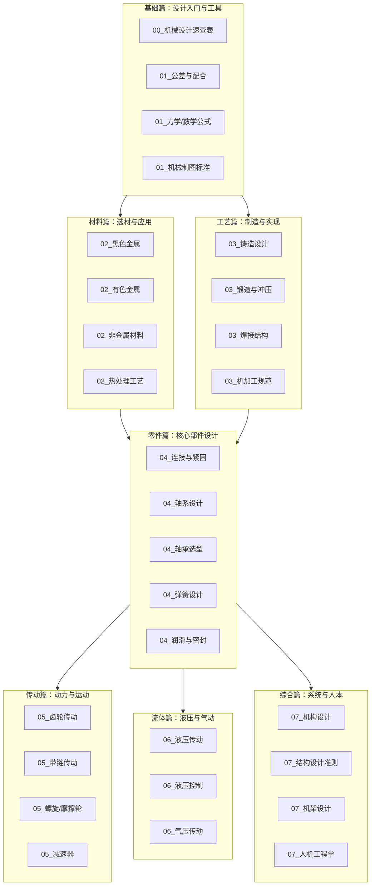

# 机械设计手册知识库 — 课程蒸馏笔记

**生成时间**: 2026-06-12T15:32:11.949709

**课程规模**: 52 课, 7.3 小时

---

好的，作为课程内容策划专家，我已根据您提供的所有课程视频摘要，为您生成了一份完整的《机械设计手册知识库》课程蒸馏笔记。

---

## 《机械设计手册知识库》课程蒸馏笔记

### 一、课程概览

**课程主题**：本课程以《机械设计手册》（第六版）为核心蓝本，旨在系统性地构建机械设计工程师所需的知识体系。课程内容覆盖从设计基础、材料工程、制造工艺到零部件设计、传动系统、流体传动及人机结构等七大核心领域，是一份高度浓缩、理论与实践并重的“云端设计手册”。

**目标受众**：本课程主要面向机械设计领域的初级至中级工程师、相关专业的在校学生，以及希望系统回顾或快速查阅机械设计核心知识的从业者。

**课程结构**：课程共52课，总时长7.3小时。课程结构并非简单的线性排列，而是采用了“基础-进阶-深化”的递进式设计。首先，通过“速查表”和“设计基础”模块建立宏观认知与核心理论框架。随后，深入“材料工程”与“制造工艺”，为设计提供物质与工艺基础。在此基础上，课程进入核心的“零部件设计”与“传动系统”模块，进行具体的工程计算与选型。最后，通过“流体传动”和“人机与结构”模块，拓展至更广泛的工程应用领域，并融入人本化与系统化设计思维。

### 二、课程体系图

**模块划分与递进关系**：
1.  **基础篇 (0-1课)**：课程起点，提供“一页纸”速查工具和设计基础理论（公差、力学、制图），为后续所有设计计算奠定语言和理论基石。
2.  **材料与工艺篇 (2-3课)**：在理论之后，介绍设计的“物质基础”和“实现手段”。工程师必须先懂得有哪些材料可用、如何制造，才能设计出合理、经济的零件。
3.  **零部件与传动篇 (4-5课)**：课程核心，将前序知识应用于具体零部件（如轴、轴承、齿轮、弹簧）的设计与选型，是机械设计最核心的工程计算环节。
4.  **流体传动篇 (6课)**：拓展至液压与气动领域，介绍另一类重要的动力与控制方式，是现代自动化机械不可或缺的知识模块。
5.  **人机与结构篇 (7课)**：从单一零件上升到整机系统，关注机构运动、结构强度、振动控制，并融入人机工程学，培养系统化、人性化的设计思维。

### 三、逐课精要

**00_速查表**
- **机械设计速查表**: 提供材料、标准件、公差、安全系数等核心数据的“一页纸”快速查阅指南，提升设计效率。

**01_设计基础**
- **公差与配合**: 系统讲解尺寸公差、配合类型、基准制、几何公差及表面粗糙度的国标体系与选用原则。
- **力学公式**: 梳理运动学、材料力学、接触应力、压杆稳定、疲劳与振动等核心力学公式，为强度校核提供工具。
- **常用资料与单位换算**: 介绍物理常数、法定计量单位、优先数系及常用换算关系，是设计计算的标准化基础。
- **深化_力学公式**: 深入解析力学公式的工程应用，通过飞轮、转轴、压杆等算例演示强度、刚度与稳定性校核全流程。
- **深化_数学公式与数表**: 讲解三角函数、对数、微积分及优先数系等数学工具在齿轮、疲劳、参数标准化中的应用。
- **深化_机械制图标准规范**: 明确图纸幅面、图线、尺寸标注、视图表达及标准件简化画法等国家标准，确保工程语言规范。

**02_材料工程**
- **有色金属材料**: 介绍铝、铜、钛、镁合金及轴承合金的性能特点、牌号含义与典型应用场景，提供快速选材指南。
- **深化_有色金属与复合材料完整表**: 提供有色金属与复合材料的完整参数体系，包括力学性能、热处理工艺及各国牌号对照。
- **深化_钢铁材料完整牌号表**: 系统梳理钢铁材料牌号体系，解析化学成分与热处理对性能的影响，并给出选材原则速查。
- **热处理工艺**: 详解退火、正火、淬火、回火及表面热处理（渗碳、氮化）的工艺参数、目的与结构设计原则。
- **非金属材料**: 介绍工程塑料、橡胶、复合材料及粉末冶金等非金属材料的性能与选用，强调其轻质、耐蚀、自润滑等特性。
- **黑色金属材料**: 系统介绍碳钢、合金钢、铸铁等黑色金属的分类、牌号规则、性能特点及典型应用。

**03_制造工艺**
- **深化_机加工完整规范**: 系统讲解车、铣、刨、磨等核心机加工方法的经济精度、切削参数及夹具设计原则。
- **深化_铸造设计完整规范**: 详解铸造工艺设计，包括金属流动性、结构要素（壁厚、圆角、拔模斜度）、热节识别与缺陷控制。
- **深化_锻造冲压与焊接完整规范**: 提供锻造温度范围、冲压回弹计算、拉深工艺及焊接接头设计、焊材选型等完整规范。
- **焊接结构**: 讲解可焊性评估（碳当量法）、焊缝设计、焊接缺陷预防及结构设计总则，如避免焊缝交叉。
- **铸造设计**: 聚焦铸件结构设计三大要素（壁厚、圆角、斜度）与十二字核心准则，强调壁厚均匀与简化型芯。
- **锻造与冲压**: 讲解锻造与冲压的工艺性分析、结构设计规范及拉深、冲裁等关键工艺的计算与缺陷控制。

**04_零部件设计**
- **弹簧设计**: 介绍弹簧分类、材料、参数计算（刚度、变形量）及设计步骤，强调旋绕比选择与稳定性校核。
- **润滑与密封**: 讲解润滑剂选择（粘度、NLGI等级）、润滑方式及密封类型（静/动密封），核心是工况匹配。
- **深化_常用电机电器选型**: 讲解三相异步、伺服、步进电机及电动推杆的选型计算，核心公式为 P=Tn/9550。
- **深化_弹簧完整设计**: 通过多个算例完整演示压缩、拉伸、扭转弹簧的设计校核，并介绍组合弹簧与疲劳强度。
- **深化_操作件小五金管件**: 介绍手柄、手轮、螺栓、垫圈、管件及阀门等标准件的选型要点与规格。
- **深化_润滑与密封完整选型**: 深入讲解基于Stribeck曲线的润滑状态、润滑油/脂的详细分类，以及机械密封的选型与冲洗方案。
- **深化_螺纹连接完整规格**: 系统讲解螺纹、键、花键、销及焊缝等连接件的强度校核与设计计算。
- **深化_起重运输机械零部件**: 介绍钢丝绳、滑轮、吊钩、输送带等起重运输关键零部件的选型要点与安全准则。
- **深化_轴承完整选型表**: 提供多种轴承的完整参数表，并通过算例演示基于寿命公式的选型流程与润滑选择。
- **深化_轴系设计完整计算**: 系统讲解轴系从材料选择、强度/刚度校核到联轴器选型的完整设计计算流程。
- **轴承选型**: 介绍滚动轴承与滑动轴承的选型方法，核心是基于当量动载荷和寿命公式的校核。
- **轴系设计**: 讲解轴的设计三步骤（扭矩估算、结构设计、弯扭校核）及联轴器、离合器的选型原则。
- **连接与紧固**: 介绍螺纹、键、销、焊接、铆接等连接方式的设计要点与强度校核公式。

**05_传动系统**
- **减速器与变速器**: 介绍圆柱齿轮、行星、蜗杆、谐波等减速器的特点、效率计算及选型流程。
- **带链传动**: 讲解V带、同步带、滚子链的设计计算方法，包括包角、带速、链速、张紧等关键参数。
- **深化_减速器完整设计**: 深入讲解减速器设计，核心为齿轮强度、轴承寿命、润滑方式及热平衡校核。
- **深化_多点啮合柔性传动**: 介绍行星、摆线、谐波等传动类型，核心设计难点为均载设计与变形协调。
- **深化_带链传动完整选型**: 通过算例演示V带、同步带、滚子链的完整10步选型流程。
- **深化_齿轮传动完整设计**: 系统讲解齿轮材料、变位、强度校核（接触/弯曲）及精度等级，并提供完整算例。
- **螺旋与摩擦轮传动**: 讲解滑动/滚珠丝杠的耐磨性、效率与自锁设计，以及摩擦轮传动的压紧力与接触强度计算。
- **齿轮传动**: 系统介绍齿轮分类、几何参数、强度校核、精度等级及材料选择，强调变位齿轮的应用。

**06_流体传动**
- **气压传动**: 介绍气动系统组成、气源处理、气缸/阀件选型及系统设计，突出其低成本、无污染但精度低的特点。
- **液压传动**: 介绍液压泵、缸、马达等核心元件及系统效率优化，强调负载敏感系统的高效性。
- **液压控制**: 深入讲解方向、压力、流量控制阀的原理与选型，并以组合机床为例分析典型回路。
- **深化_气压传动完整设计**: 通过算例演示空压机、气缸、真空系统的完整选型计算与配管设计。
- **深化_液压传动完整设计**: 通过单柱压机等算例，演示液压系统从工况分析、元件选型到热平衡校核的七步法。
- **深化_液压控制完整回路设计**: 深入分析调压、调速、同步等回路，并对比节流与容积调速的效率差异。

**07_人机与结构**
- **人机工程学**: 基于人体尺寸数据，讲解工作空间、操作力、显示器布局等设计原则，核心是“以人为中心”。
- **机械产品结构设计准则**: 系统梳理功能、强度、刚度、工艺、经济性等十二大设计准则，指导产品开发全过程。
- **深化_机构设计完整方法**: 讲解平面连杆、凸轮、间歇机构的设计方法，核心是自由度计算与运动规律设计。
- **深化_机架与结构设计**: 介绍机架分类、材料选择及梁的弯曲计算，强调闭式截面（箱形、工字形）的高刚度优势。
- **深化_机械产品结构设计准则**: 通过正误案例对比，深化讲解DFM准则、焊接设计禁忌与安全设计原则。
- **深化_机械振动控制与利用**: 讲解振动理论、隔振设计及阻尼应用，核心是使工作频率避开共振区。

### 四、跨课程主题图谱

| 核心主题 | 出现位置 | 核心观点 |
| :--- | :--- | :--- |
| **安全系数** | `00_机械设计速查表`、`01_力学公式`、`07_结构设计准则`、`03_锻造冲压焊接`、`05_齿轮传动` | 安全系数的选取是塑性材料（有变形预警，取小）与脆性材料（无预警，取大）的根本区别，且需根据工况（静/动/冲击）和零件重要性动态调整。 |
| **标准化与“三化”** | `01_深化_数学公式`、`01_机械制图标准`、`04_操作件小五金`、`07_深化_结构设计准则` | 优先数系（优先选用R10系列）是实现“标准化、系列化、通用化”的核心工具，通过最少的规格数覆盖整个设计范围，降低成本，提高通用性。 |
| **应力集中** | `01_深化_力学公式`、`02_热处理工艺`、`03_铸造/锻造/焊接`、`07_结构设计准则` | 应力集中是导致疲劳失效的元凶，设计上应通过“避免尖角，采用圆角过渡”、“避免截面突变”、“避免焊缝交叉”等措施将其降至最低。 |
| **刚度与轻量化** | `01_力学公式`、`07_深化_机架设计`、`07_深化_结构设计准则` | 在材料用量相同的情况下，优先采用“闭式截面”（工字形、箱形）以显著提升刚度，是实现轻量化的核心设计思路。 |
| **热处理与材料性能** | `02_黑色金属`、`02_热处理工艺`、`02_深化_钢铁材料`、`05_齿轮传动` | 材料的性能并非固定，可通过热处理（如调质、渗碳淬火）进行调控。设计者需理解“表面硬、芯部韧”等目标，并据此选择材料与工艺。 |
| **表面粗糙度与加工方法** | `01_公差与配合`、`03_深化_机加工完整规范` | 表面粗糙度Ra值与加工方法是直接关联的。例如，Ra 1.6μm对应精车或精磨，是“一般IT7配合面”的推荐值。 |
| **传动效率与热平衡** | `05_减速器`、`05_螺旋与摩擦轮`、`06_液压传动`、`06_深化_液压传动设计` | 传动系统的效率是设计关键，尤其蜗杆传动和液压系统效率较低。当效率低时，必须进行热平衡校核，必要时增加散热措施。 |
| **润滑与工况匹配** | `04_润滑与密封`、`04_深化_润滑密封`、`05_减速器`、`06_气压传动` | 润滑方式（脂/油/油气等）和润滑剂的选择完全取决于工况（速度、载荷、温度）。如“速度越高，选粘度越低；载荷越大，选粘度越高”。 |
| **疲劳强度** | `01_力学公式`、`01_深化_力学公式`、`07_结构设计准则` | 大部分机械失效源于疲劳。提高疲劳强度的核心措施包括“降低应力集中”和“引入残余压应力”（如喷丸处理）。 |

### 五、关键概念词汇表

1.  **公差 (Tolerance)**：允许尺寸、几何形状和相互位置等的变动量。是保证零件互换性和满足装配要求的基础。
2.  **配合 (Fit)**：基本尺寸相同的、相互结合的孔和轴公差带之间的关系，分为间隙、过盈和过渡三种。
3.  **优先数系 (Preferred Numbers)**：公比为10的r次方根的几何级数，用于标准化参数分级，以最少规格覆盖整个范围（如R10系列）。
4.  **热处理 (Heat Treatment)**：通过加热、保温和冷却改变金属内部组织结构，从而改善其力学性能的工艺方法。四大基本工艺为退火、正火、淬火、回火。
5.  **调质 (Quenching and Tempering)**：将钢材淬火后进行高温回火的热处理工艺，旨在获得回火索氏体，实现强度与韧性的良好平衡。
6.  **应力集中 (Stress Concentration)**：零件截面突变（如台阶、孔、沟槽）处局部应力远大于平均应力的现象，是导致疲劳断裂的主要原因。
7.  **疲劳强度 (Fatigue Strength)**：材料在交变应力作用下抵抗破坏的能力，通常用疲劳极限σ-1表示，远低于抗拉强度。
8.  **旋绕比 (Spring Index, C)**：弹簧设计中，弹簧中径D与线径d的比值（C=D/d）。推荐范围4~16，常用5~8，影响卷制难易和稳定性。
9.  **当量动载荷 (Equivalent Dynamic Load, P)**：将轴承承受的实际复合载荷（径向和轴向）折算成对轴承寿命影响相同的纯径向或纯轴向载荷。
10. **传动比 (Transmission Ratio, i)**：机构中输入转速与输出转速的比值，是减速器、齿轮箱等传动装置的核心参数。
11. **赫兹接触应力 (Hertzian Contact Stress)**：两曲面物体在压力作用下，在接触区域产生的局部应力，是计算齿轮、轴承等接触强度的理论基础。
12. **欧拉公式 (Euler's Formula)**：计算细长压杆临界失稳载荷的公式，适用于大柔度杆，是压杆稳定性设计的基石。
13. **碳当量 (Carbon Equivalent, CE)**：将钢材中各种合金元素对淬硬倾向的影响折算成碳含量的一个指标，用于评估其可焊性。
14. **人机工程学 (Ergonomics)**：研究人、机器及其工作环境之间相互作用的学科，旨在使设计符合人体尺寸、生理和心理特性，提高效率和安全性。
15. **刚度 (Stiffness)**：零件或构件在载荷作用下抵抗弹性变形的能力。高刚度是保证精密机械性能的关键。
16. **爬行 (Stick-Slip)**：执行元件（如液压缸、气缸）在低速运动时出现的时走时停、不均匀的抖动现象，通常由摩擦力特性与系统刚度不匹配导致。
17. **PV值 (Pressure-Velocity Value)**：轴承或密封面承受的压力与滑动速度的乘积，是衡量其发热和磨损工况的重要指标。
18. **临界转速 (Critical Speed)**：旋转机械（如转子、轴系）的固有频率，当工作转速接近临界转速时，系统将发生剧烈共振，必须避开。

### 六、可执行行动清单

**高优先级 (直接影响设计与安全)**
1.  **规范图纸标注**：在任何零件图中，首先检查公差、表面粗糙度、几何公差和热处理要求是否已按国标明确标注。
2.  **进行强度校核**：对关键轴、齿轮、螺栓等承力零件，必须按“强度设计三步法”进行弯扭合成强度或疲劳强度校核。
3.  **计算轴承寿命**：为新设计或改造的轴系选择轴承时，严格执行基于当量动载荷P和额定动载荷C的寿命(L10h)计算。
4.  **估算安全系数**：在完成应力计算后，立即根据材料类型（塑性/脆性）和工况（静/动/冲击）选择或校核安全系数，确保其在推荐范围内。
5.  **确定配合类型**：在设计孔轴配合时，优先采用基孔制，并根据功能需求（传动、定位、滑动）从手册或速查表中选定具体的配合代号（如H7/k6）。
6.  **选择润滑方案**：根据轴承或齿轮的dn值、载荷和温度，从手册中确定润滑剂类型（油/脂/固体）及具体的粘度或稠度等级。
7.  **避免应力集中**：在零件结构设计时，强制要求所有尖角部位增加圆角（R≥2mm），并检查截面是否突变。

**中优先级 (提升设计质量与效率)**
8.  **建立选材逻辑**：在设计初期，根据零件的功能（如结构件、传动件、耐磨件）、载荷和制造工艺，快速从“选材速查表”中确定候选材料。
9.  **使用标准件**：在满足功能要求的前提下，优先选用螺栓、螺母、轴承、键、密封圈等标准件，并限制同一设备内的规格种类。
10. **应用优先数系**：在设计参数（如轴径、功率、中心距）时，将计算值圆整为最接近的优先数系（R10/R20）标准值，实现“三化”。
11. **设计张紧装置**：对于带传动和链传动，在设计阶段就规划好中心距调节或张紧轮方案，确保初始张紧力和垂度可控。
12. **考虑工艺性**：在设计铸件、锻件、焊接件时，对照“结构设计准则”，检查壁厚均匀性、拔模斜度、焊缝布置等是否合理。
13. **核算经济精度**：标注零件尺寸公差时，先思考“此功能需要多高的精度？”，优先选择对应加工方法的经济精度等级，避免过度设计。

**低优先级 (拓展视野与优化)**
14. **学习热处理工艺**：在选定材料后，查阅其常规热处理工艺（如45钢调质），并在图纸上明确标注热处理要求（如硬度HRC 22-32）。
15. **了解流体传动**：当设计需要大推力、高精度直线运动或防爆环境时，可主动查阅液压或气动系统的设计指南，评估其可行性。
16. **应用人机工程学**：在设计操作手柄、控制面板或工作台时，查阅人体尺寸数据，确保操作力、视野范围符合人机工程要求。
17. **进行振动分析**：对于高速旋转设备，初步估算其临界转速，确保工作转速避开共振区，并考虑隔振措施。

### 七、核心金句集

1.  “材料韧性好取小（断裂前有变形预警），材料脆性取大（无塑性变形预警）。” —— `00_机械设计速查表` (关于安全系数选取原则)
2.  “表面硬、芯部韧。” —— `02_热处理工艺` (概括表面热处理的核心目的)
3.  “避免尖角，采用圆角过渡（R≥2mm）。” —— `02_热处理工艺` / `07_结构设计准则` (关于减少应力集中的金科玉律)
4.  “经济精度能满足要求时，不选更精密的加工。” —— `03_深化_机加工完整规范` (核心工程经济原则)
5.  “C值过小（C<4）：弹簧卷制困难，内侧应力集中严重；C值过大（C>16）：弹簧稳定性差。” —— `04_深化_弹簧完整设计` (弹簧旋绕比选择的工程意义)
6.  “泄漏量与h³成正比，间隙增大一倍→泄漏量增大8倍。” —— `04_深化_润滑与密封完整选型` (强调密封间隙控制的极端重要性)
7.  “同样重量下，工字钢和矩形竖放截面的刚度远优于实心圆，是轻量化首选。” —— `07_深化_结构设计准则` (轻量化设计的核心思路)
8.  “隔振设计的关键在于使工作频率f≥√2×f_n，通常取f=(3~5)f_n，才能有效降低振动传递。” —— `07_深化_机械振动控制与利用`
9.  “优先选用粗牙。” —— `04_连接与紧固` (螺纹连接中，粗牙是最通用的选择)
10. “变位齿轮：正变位提高齿根强度，增大中心距；负变位降低齿根强度，减小中心距。” —— `05_齿轮传动` (变位齿轮的核心作用)
11. “满载时效率最高。” —— `05_减速器与变速器` (关于减速器效率的工程经验)
12. “压紧力远大于圆周力本身（K/μ可达数倍至十数倍）。” —— `05_螺旋与摩擦轮传动` (摩擦轮传动的设计难点)
13. “排气节流调速最常用。” —— `06_气压传动` (气动系统调速的标准做法)
14. “容积调速无节流损失，效率高。” —— `06_深化_液压控制完整回路设计` (液压系统节能设计的关键)
15. “70%的成本在设计阶段已决定。” —— `07_深化_结构设计准则` (强调前期设计对成本的决定性作用)

---

## 附录：逐课摘要

### 00_速查表/机械设计速查表 (8.0分钟)

### 00_速查表/机械设计速查表

本课程视频《机械设计速查表》系统整合了《机械设计手册》第六版中的常用设计数据、公式与选型指南，以“一页纸速查风格”呈现，旨在帮助工程师和学生快速获取关键参数，提高设计效率。视频核心主题涵盖材料性能、单位换算、标准件选型、公差配合、表面粗糙度、热处理硬度以及安全系数等机械设计中的基础且重要的内容。

视频提炼了多个核心知识点。首先，在**材料性能速查**部分，不仅列出了碳素钢、合金钢、铸铁、铝合金及非金属材料（如尼龙PA66、聚四氟乙烯PTFE）的密度、弹性模量、抗拉强度等关键参数，还强调了以钢（7.85 g/cm³）为基准的密度对比，方便快速选材。其次，在**标准件选型**方面，视频详细讲解了螺栓、滚动轴承和联轴器的选型流程。例如，螺栓选型遵循“确定载荷→选择强度等级→计算最小直径→确定预紧力”的步骤，并给出了关键公式；轴承选型则需根据载荷与转速计算额定动载荷，并引用核心公式“L_h=(C/P)^ε×10⁶/60n”进行寿命校核。最后，视频系统梳理了**公差配合与表面粗糙度**的选用，推荐了基孔制（H7）下齿轮与轴的典型配合（H7/r6过盈配合，H7/k6过渡配合），并给出了不同公差等级（IT5~IT14）对应的表面粗糙度Ra推荐值，如“一般IT7配合面”推荐Ra1.6μm，并指出该粗糙度对应精车或精磨的“看不清加工痕迹”状态。

视频还重点强调了**安全系数**的选取原则，区分了塑性材料（如钢）与脆性材料（如铸铁）的基准差异，并针对不同工况（均匀载荷、严重冲击）和零件重要性（普通传动轴、起重机吊钩）给出了具体推荐值。例如，对于塑性材料，均匀载荷下安全系数可取1.2~1.5，而重要零件如吊钩则需取3.0~5.0。视频中明确指出：“材料韧性好取小（断裂前有变形预警），材料脆性取大（无塑性变形预警）”，这一原则简洁地概括了安全系数选用的核心逻辑。此外，视频还提供了传动效率速查表、热处理硬度对照表（如45钢调质HRC22~32）以及常用设计公式（如T=9550P/n），为机械设计中的动力计算和零件强度校核提供了直接、实用的参考。

### 01_设计基础/公差与配合 (2.0分钟)

### 01_设计基础/公差与配合

本课程视频系统介绍了机械设计中公差与配合的核心概念与标准体系，内容涵盖尺寸公差、配合类型、基准制选择、几何公差及表面粗糙度等关键模块。视频首先明确了基本尺寸、实际尺寸、极限尺寸以及上/下偏差等基础术语，并给出公差计算公式（T = |ES-EI|）。配合分为间隙、过盈和过渡三种类型，依据GB/T 1800.1-2009标准，公差等级分为IT01至IT18共20级，常用组合如IT5/IT6（精密）、IT7/IT6（一般）和IT11/IT12（粗糙）。基准制优先采用基孔制（H，EI=0），基轴制（h，es=0）则适用于冷拉轴或一轴多孔场景。视频还列举了常用配合实例，如H7/g6用于精密滑动，H7/s6用于中等过盈。

视频进一步讲解了配合选择原则：确定配合性质→选基准制→选公差等级（配合面IT5~IT7，非配合面IT11~IT13）→查表确定偏差。同时介绍了未注公差（按GB/T 1804-2000分f、m、c、v四级）和几何公差，包括形状公差（直线度、平面度、圆度、圆柱度）、方向公差（平行度、垂直度、倾斜度）、位置公差（同轴度、对称度）及跳动公差（圆跳动、全跳动）。视频强调：“公差带形状：⌀ 表示圆柱形，否则为两平行平面/圆之间”，并说明了基准标注（A、B、C）及最大/最小实体要求（Ⓜ、Ⓛ）等标注原则。

最后，视频聚焦表面粗糙度标准，指出最常用参数为轮廓算术平均偏差Ra，补充参数为轮廓最大高度Rz。Ra优先值系列从0.012μm（超精密加工，镜面）至50μm（粗加工，明显刀痕），对应加工方法涵盖超精密加工、精密磨削、精车、半精车、粗车等。视频通过案例推荐了典型部位的Ra值，如精密滚动轴承配合面0.2~0.4μm，一般滚动轴承配合面0.4~0.8μm，齿轮齿面0.8~3.2μm，铸件非加工面12.5~50μm。视频最后强调：“Ra 最常用”，并建议参考GB/T 1800.1-2009、GB/T 1804-2000、GB/T 1184-1996、GB/T 10610-2009等标准。

### 01_设计基础/力学公式 (1.0分钟)

### 01_设计基础/力学公式

本课程视频系统梳理了机械设计中最核心的力学公式体系，内容涵盖运动学与动力学、材料力学、接触应力、压杆稳定性、疲劳强度及振动基础六大模块。视频以《机械设计手册》第六版为权威依据，将复杂的力学理论转化为可直接应用于工程计算的公式集合，旨在帮助学习者建立从基础运动分析到强度校核的完整知识框架。视频强调公式的实用性和关联性，例如在材料力学部分，不仅列出了正应力、剪应变等基本概念，还给出了常见材料（如碳钢、铝合金、橡胶）的弹性模量、泊松比等关键常数，为后续的梁弯曲、扭转计算提供了数据支撑。

视频重点提取了多个关键知识点：首先是**运动学与动力学**中的转动惯量计算，详细列出了实心圆柱、细杆、球体等典型物体的公式，这是分析旋转机械动力学的基础；其次是**材料力学**中的组合变形强度理论，特别是针对塑性材料的第三、第四强度理论及其在圆轴弯扭组合下的简化公式（如σ_r3 = √(M²+T²)/W），这是轴类零件强度校核的核心；再次是**接触应力**中的赫兹公式，视频给出了两圆柱体接触和齿轮接触强度的具体计算式，并提供了钢对钢的简化公式，对齿轮、轴承设计至关重要；最后是**压杆稳定性**中的欧拉公式与临界应力分类，明确了细长杆、中柔度杆和粗短杆的不同失效模式及对应公式。

视频通过大量表格和公式化表达，将抽象概念转化为可直接套用的工具。例如，在讲解疲劳强度时，给出了“**碳钢的疲劳极限σ₋₁ ≈ 0.4~0.55·σ_b**”这一经验关系，帮助设计者快速估算材料寿命。又如，在振动基础部分，简支轴临界转速的近似公式“**n_cr ≈ 1.2×10⁸·√(d/(L⁴·m))**”为高速旋转机械的避振设计提供了便捷的工程估算方法。整体而言，视频是对机械设计力学知识的一次高效汇编，适合作为设计计算时的快速查阅指南。

### 01_设计基础/常用资料与单位换算 (1.0分钟)

### 01_设计基础/常用资料与单位换算

本课程视频以“常用资料与单位换算”为核心主题，系统梳理了机械设计领域的基础知识与标准化工具。内容主要依据《机械设计手册》第六版及相关国家标准（如GB 3100-1993、GB/T 321-2005），涵盖常用物理常数、几何公式、法定计量单位、优先数系、物理量单位换算以及数学与力学公式等关键模块。视频旨在为设计人员提供一份高效、准确的基础资料速查指南，帮助其在工程实践中快速获取标准数据，提升设计效率与规范性。

课程重点提炼出以下知识要点：一是**常用物理常数与几何公式**，如重力加速度（9.80665 m/s²）、标准大气压（101325 Pa）及圆面积、圆柱体积等基础计算公式，是设计计算的起点。二是**法定计量单位与换算**，详细介绍了SI基本单位（如米、千克、秒）及SI词头（从尧[它]到幺[科托]共20个），并提供了长度、力、压力、功率、温度等常见物理量的换算关系，例如“1 in = 25.4 mm”、“1 MPa = 1 N/mm²”。三是**优先数与优先数系**，强调标准化设计中的分级原则，如“优先选用 R10 系列”，并指出“公比越小，规格越多，选择余地越大，但标准化程度降低”。四是**常用力学与材料力学公式**，包括牛顿第二定律、胡克定律、弯曲正应力及压杆稳定性的欧拉临界载荷公式等，为结构分析与强度校核提供了理论支撑。

视频内容虽然时长仅1分钟，但信息密度极高，结构清晰，从基础常数到复杂力学公式层层递进，兼具理论性与实用性。例如，在介绍优先数系时强调的“优先选用 R10 系列”原则，直接指导了设计中的参数标准化选择。整体而言，该视频是一份浓缩的设计工具手册，适合机械设计初学者快速建立知识框架，也适合从业者作为日常查阅的参考。

### 01_设计基础/深化_力学公式 (20.0分钟)

### 01_设计基础/深化_力学公式

本课程视频系统梳理了《机械设计基础》中力学公式的核心模块，涵盖运动学与动力学、材料力学、接触应力、压杆稳定性、疲劳强度及振动基础六大领域。视频从基础定义出发，逐步深入到工程应用，重点讲解了各类公式的推导、适用条件及实际算例。例如，在运动学部分，通过“飞轮加速算例”演示了角速度与转数的计算；在动力学部分，则通过“人从转台边缘走到中心”的动量矩守恒算例，直观展示了角速度的变化规律。视频强调，掌握这些公式是进行机械结构设计与校核的前提。

视频提炼了多个关键知识点：**一是转动惯量的计算**，包括常见几何体的公式（如细圆环 \( J=mR^2 \)）和平行轴定理（\( J = J_C + md^2 \)），并通过“飞轮与联轴器总惯量”算例强化应用。**二是梁弯曲与扭转的强度与刚度校核**，视频详细列出了简支梁、悬臂梁等9种工况的挠度与转角公式，并通过算例2-1（简支钢梁）和算例2-2（传动轴）演示了如何根据挠跨比和强度、刚度条件确定截面尺寸。**三是压杆稳定性分析**，系统讲解了欧拉公式的适用范围（大柔度杆）及中柔度杆的直线/抛物线公式，并通过算例4-1（Q235圆截面压杆）对比了不同边界条件（两端铰支与两端固定）对临界载荷和安全系数的影响。

视频中多次出现工程实用的金句与公式。例如，在建立力学与功率的联系时，强调“\( P = \dfrac{Tn}{9550} \)”是工程中计算功率的关键公式。在压杆稳定部分，明确指出了欧拉公式的局限性：“欧拉公式仅适用于 \( \lambda \geq \lambda_p \) 的大柔度杆”。此外，视频对疲劳强度的校核流程进行了完整演示，通过算例5-1（转轴校核）得出安全系数 \( n=2.58 \)，并总结出提高疲劳强度的核心措施包括“降低应力集中”和“引入残余压应力”。最后，在振动基础部分，视频通过单盘转子与多盘转子的算例，强调了工作转速需避开临界转速的0.7~1.4倍范围，并作出“不安全，需修改设计”的工程判断。

### 01_设计基础/深化_数学公式与数表 (16.0分钟)

### 01_设计基础/深化_数学公式与数表

本课程视频系统梳理了机械设计过程中所需的数学基础知识，涵盖三角函数、对数与指数、代数与解析几何、微积分以及标准化数系等核心内容。视频以工程应用为导向，不仅提供了各类数学公式与数表（如三角函数表、渐开线函数表、常用对数表等），还重点讲解了优先数系（GB/T 321-2005）在参数标准化中的应用。通过齿轮传动、振动分析、疲劳寿命计算等实例，视频将抽象的数学工具与具体的机械设计场景紧密结合，旨在提升学习者的工程计算与参数选择能力。

视频提炼了多个关键知识点：**1）三角函数与反三角函数**：系统给出了倍角、半角、和差化积等公式，并强调“符号由θ/2所在象限决定”，同时提供了任意角度的快速查表方法；**2）对数与指数在工程中的应用**：以疲劳S-N曲线（lg N = lg C - m lg σ，钢 m≈9）、轴承寿命计算等为例，展示了指数和对数在可靠性分析中的重要作用；**3）渐开线函数与齿轮设计**：重点介绍了渐开线方程（r = r_b / cosα，θ = tanα - α）及其函数表，并明确指出“标准压力角20°时：inv 20° = 0.014904”，是齿轮齿廓计算的关键依据；**4）优先数系与“三化”**：定义了优先数系为“公比为10的r次方根的几何级数”，并通过减速器输出轴径（如33.8mm取35.5mm）等案例，说明了如何将计算值圆整为标准值，实现“标准化、系列化、通用化（三化）的最优平衡”。

视频中多次强调，数学公式与数表不仅是理论工具，更是连接设计与制造的桥梁。例如，课程指出“优先数系通过简单的几何级数，以最少的规格数覆盖整个设计范围”，这深刻揭示了标准化参数对降低成本、提高通用性的核心价值。同时，对于复杂计算，课程推荐使用复合辛普森公式等数值方法，并提醒“对于梁的挠度曲线积分、应力面积矩计算，推荐使用复合辛普森公式（精度高、收敛快）”。整体而言，本视频为机械设计人员提供了一套系统、实用且标准化的数学工具集。

### 01_设计基础/深化_机械制图标准规范 (1.0分钟)

### 01_设计基础/深化_机械制图标准规范

本课程视频系统介绍了机械制图的核心国家标准规范，内容涵盖图纸幅面与格式、比例、图线、字体、尺寸标注、视图表达、装配图要求及标准件简化画法等关键模块。视频以《机械设计手册》第六版为依据，强调制图标准化对工程交流与生产制造的重要性，是机械设计入门与深化学习的必备基础。

课程重点提炼了五个知识点：一是图纸幅面与图框格式，明确了A0至A4各幅面的尺寸、边框及装订边要求，并介绍了加长幅面的常用规格；二是图线的分类与用途，如粗实线用于可见轮廓线、细点画线用于轴线、双点画线用于假想轮廓等，强调线宽与线型的规范性；三是尺寸标注的组成与规则，包括尺寸线、尺寸界线、箭头及数字的书写方向，特别指出“角度尺寸数字一律水平书写”；四是视图表达方式，涵盖基本视图、剖视图、断面图等，其中剖视图又细分为全剖、半剖、局部剖、阶梯剖、旋转剖和复合剖，以适应不同结构表达需求；五是装配图与标准件画法，强调零件序号、明细栏、配合标注及螺纹、弹簧、轴承等简化画法。

视频内容严谨、结构清晰，将抽象标准转化为具体可操作的制图规范，特别适合机械设计初学者及工程技术人员系统学习。正如课程所强调的：“图线是工程语言的笔画，比例是空间思维的尺度”，掌握这些标准规范，是确保图纸清晰、准确、可传递设计意图的关键。

### 02_材料工程/有色金属材料 (1.0分钟)

### 02_材料工程/有色金属材料

本课程视频系统介绍了有色金属材料在机械工程中的分类、性能与应用，重点涵盖铝合金、铜合金、钛合金、镁合金及轴承合金等关键材料。内容依据《机械设计手册》第六版及相关国家标准（如GB/T 1173-2013、GB/T 3621-2007等），从材料牌号、化学成分、力学性能、加工特性到典型应用场景，提供了全面的技术参考。视频强调有色金属因其轻质、高强、耐蚀、导电导热等优异性能，在航空、汽车、海洋工程、电子器件等领域具有不可替代的地位。

核心知识点包括：**铸造铝合金**（如ZL101、ZL104）具有良好的铸造性和综合力学性能，适用于复杂形状零件和发动机壳体；**变形铝合金**（如6061、7075）可通过热处理强化，广泛应用于结构件和航空蒙皮；**铜合金**中，纯铜导电导热性最佳，而锡青铜、铍青铜则因耐磨和弹性好被用于轴承和精密弹簧；**钛合金**（如TC4）密度低、强度高、耐蚀性强，是航空航天和医疗植入的首选材料；**镁合金**作为最轻的结构金属，在轻量化设计中优势显著，但需注意其耐蚀性较差。

视频最后以“有色金属选用速查”表格总结了不同工况下的推荐材料，如“导电首选T2纯铜”“高强度选7075铝或TC4钛”“轻量化选镁合金”等，为工程设计提供了直观的选材指南。整体内容专业详实，适用于机械、材料及相关专业学生的学习与工程实践参考。

### 02_材料工程/深化_有色金属与复合材料完整表 (18.0分钟)

### 02_材料工程/深化_有色金属与复合材料完整表

本课程视频系统讲解了有色金属与复合材料的完整参数体系，涵盖铸造铝合金、变形铝合金、铜及铜合金、钛合金、镁合金、轴承合金（巴氏合金）以及玻璃纤维与碳纤维增强塑料等七大材料类别。视频以《机械设计手册》为蓝本，重点展示了各类材料的牌号含义、化学成分、力学与物理性能、热处理工艺参数以及典型应用案例，为工程选材提供了全面的数据支撑。

视频提炼了多个关键知识点：一是**材料牌号与状态代号的含义**，如铸造铝合金“ZL101”中“ZL”代表铸造铝合金，“1”为Al-Si系；变形铝合金采用四位数字体系，如2xxx为Al-Cu系，6xxx为Al-Mg-Si系；状态代号如T6表示“固溶+完全人工时效”。二是**材料性能的对比与选材逻辑**，如TC4钛合金“综合性能最好，最常用”，7075铝合金“超高强度，比强度最高”，而镁合金密度仅1.74~1.85 g/cm³，阻尼容量为钢的50~100倍。三是**复合材料的优势与局限**，视频强调CFRP“比强度高达1097 MPa·cm³/g，是钢的12倍，是铝的5倍”，但“成本高、冲击韧性差、修复难”。

视频中多次引用核心金句，如“6061综合性能最佳，热处理强化”“CFRP-T300比强度高达1097，是钢的12倍，是铝的5倍”，这些表述直观揭示了不同材料在工程应用中的独特价值。此外，视频还提供了各国牌号对照表与热处理工艺参数表（如TC4退火温度730~800°C，固溶后480~550°C时效4~8小时），帮助学习者从理论与实践两个层面掌握有色金属与复合材料的设计选型与工艺制定方法。

### 02_材料工程/深化_钢铁材料完整牌号表 (17.0分钟)

### 02_材料工程/深化_钢铁材料完整牌号表

本课程系统梳理了《机械设计手册》第六版中钢铁材料的完整牌号体系，涵盖了碳素结构钢、优质碳素结构钢、合金结构钢、弹簧钢、轴承钢、不锈钢、铸铁及铸钢等九大类材料。课程以牌号命名规则为切入点，详细解析了化学成分、力学性能与热处理工艺的对应关系，旨在帮助学习者掌握工程选材与工艺设计的基本方法。例如，碳素结构钢中“Q235”的“Q”代表屈服强度字头，“235”表示最小屈服强度235 MPa，而等级后缀A/B/C/D则依次代表低温冲击韧性递增、杂质含量递减。课程强调：“Q235是最通用碳素结构钢”，而45钢则是“最常用的中碳调质钢”，适用于齿轮、主轴等典型零件。

课程重点突出了合金元素对钢材性能的调控作用，通过大量表格对比了不同牌号的化学成分范围、力学性能参数及热处理规范。例如，40Cr作为“最常用合金调质钢”，其含碳量0.37~0.44%、Cr含量0.80~1.10%，综合性能优异；20CrMnTi则为“最常用渗碳钢”，广泛用于汽车变速箱齿轮。课程还引入了端淬曲线数据，如40Cr在距淬火端1.5mm处硬度为58HRC，50mm处降至29HRC，直观展示了淬透性对选材的影响。此外，不锈钢部分提供了新国标与旧牌号对照表（如06Cr19Ni10即304），并区分了马氏体、奥氏体及沉淀硬化型不锈钢的耐蚀性与力学特性。

课程最后提供了选材原则速查表与热处理工艺参数速查表，将理论知识与工程实践紧密结合。例如，“一般焊接结构（无冲击）”推荐Q235A，“小型轴/齿轮（调质）”推荐45钢，“中型轴/齿轮（较高强度）”推荐40Cr，“大截面高强”推荐42CrMo。课程还指出：“当零件截面直径（或厚度）大于试样尺寸时，力学性能需按截面系数折减”，并附有相应折减系数表。此外，附录中包含了钢材重量计算公式、硬度换算表及常见热处理缺陷（如淬火裂纹、回火脆性、白点）的防止措施，为实际工程应用提供了全面、实用的参考依据。

### 02_材料工程/热处理工艺 (2.0分钟)

### 02_材料工程/热处理工艺

本课程视频系统介绍了热处理工艺的核心内容，涵盖分类、关键工艺参数、适用材料及缺陷预防。首先，视频详细讲解了热处理的基本分类，包括整体热处理（退火、正火、淬火、回火）和表面热处理（感应淬火、渗碳、氮化、碳氮共渗），并重点强调了铁碳合金平衡图中的关键温度点（A₁、A₃、Acm线）对工艺选择的重要性。例如，退火分为完全退火、球化退火和去应力退火，分别用于细化晶粒、降低硬度和消除内应力；正火成本低于退火，常用于改善组织；淬火介质包括水、油、盐水等，方法有单液、双液、分级和等温淬火。回火则根据温度分为低温、中温和高温回火，其中“淬火+高温回火=调质”是获得回火索氏体、实现良好综合力学性能的关键工艺。表面热处理的核心目标正如视频中所强调的：“表面硬、芯部韧”，通过感应淬火、渗碳、氮化等方法在零件表面形成高硬度层，同时保持芯部韧性。

视频后半部分聚焦于热处理工艺的结构设计原则、余量预留及技术要求。结构设计上，视频明确要求“避免尖角，采用圆角过渡（R≥2mm）”，同时强调截面厚度应尽量均匀、孔槽对称布置，复杂零件需分体设计再组装，以减少变形和开裂风险。在余量预留方面，视频给出了具体数据：淬火变形量0.1~0.3mm、渗碳0.05~0.15mm、氮化0.01~0.03mm，并需预留精磨或微量磨削余量。此外，视频还指导如何正确提出热处理要求，包括标注热处理方法、硬度范围及测试位置、渗层深度、变形量要求及表面处理（如发黑、磷化），并引用了JB/T 5000.8-2007、GB/T 16923-2008等国家标准作为参考依据。

**核心知识点提取**：
1. **热处理四大工艺**：退火、正火、淬火、回火的具体温度范围、冷却方式及适用材料。
2. **调质定义**：淬火+高温回火，获得回火索氏体，硬度通常为25~35 HRC。
3. **表面热处理目的**：“表面硬、芯部韧”，通过感应淬火、渗碳、氮化等方法实现。
4. **结构设计原则**：避免尖角、均匀截面、对称布置、复杂件分体设计。
5. **余量预留标准**：淬火变形0.1~0.3mm，渗碳0.05~0.15mm，氮化0.01~0.03mm，并需预留磨削余量。

**金句引用**：
- “表面硬、芯部韧” —— 概括表面热处理的核心目的。
- “避免尖角，采用圆角过渡（R≥2mm）” —— 强调结构设计对减少应力集中的重要性。

### 02_材料工程/非金属材料 (1.0分钟)

### 02_材料工程/非金属材料

本课程视频系统介绍了《机械设计手册》中非金属材料的关键内容，重点涵盖工程塑料、橡胶、复合材料及粉末冶金材料四大类。视频以表格形式清晰呈现了各类材料的性能参数、适用工况及选用原则，强调非金属材料在现代机械工程中因轻质、耐腐蚀、绝缘、自润滑等特性，已成为金属材料的重要补充。例如，工程塑料部分详细对比了热塑性塑料（如PE、PP、PA）与热固性塑料（如酚醛树脂）的特点，并指出聚四氟乙烯（PTFE）具有“摩擦系数最低、耐蚀最好”的特点，而聚酰亚胺（PI）和PEEK则适用于高温工况。

视频提炼了多个实用知识点：一是工程塑料的选用需综合考虑强度、耐磨、耐温、耐腐蚀等工况，如精密齿轮推荐POM和PA，透明件选PC或PMMA；二是橡胶材料的耐油性与耐温性需匹配，丁腈橡胶（NBR）适合油封，硅橡胶（VMQ）和氟橡胶（FKM）可承受250°C高温；三是复合材料中，玻璃钢（GFRP）密度仅为钢的1/4，但强度接近碳钢，而碳纤维复合材料（CFRP）具有“比强度/比模量最高”的突出优势。此外，粉末冶金含油轴承的铁基与铜基选型也需根据载荷与速度权衡。

视频还强调了设计注意事项，如“塑料强度随温度升高而下降，设计安全系数取3~5”，以及橡胶硬度（邵氏A）与用途的对应关系（如O型圈静密封常用50~70度）。这些内容源自《机械设计手册》第六版，为机械工程师提供了标准化的非金属材料选型与设计参考，兼具理论性与实用性。

### 02_材料工程/黑色金属材料 (2.0分钟)

### 02_材料工程/黑色金属材料

本视频系统介绍了《机械设计手册》中黑色金属材料的分类、牌号命名规则及其工程应用。核心主题围绕如何根据材料性能与使用场景选择合适的钢材与铸铁。视频重点讲解了牌号命名依据GB/T 221-2008标准，例如Q235AF中的“Q”代表屈服强度，“235”表示数值，“A”为质量等级，“F”为沸腾钢；而45钢则直接以平均含碳量0.45%命名。内容覆盖碳素结构钢、优质碳素结构钢、合金结构钢、铸铁、铸钢、弹簧钢、轴承钢及不锈钢等大类，并强调了不同含碳量对应的热处理工艺：低碳钢（≤0.25%）适用于渗碳处理，中碳钢（0.25-0.60%）常用于调质处理，高碳钢（>0.60%）则需淬火加中温回火以用于弹簧等弹性元件。

视频提炼了多个关键知识点。首先，碳素结构钢中的Q235被明确为“最常用”的焊接结构材料；优质碳素结构钢中，“45钢是机械设计中最常用的材料”，广泛用于轴和齿轮等传动件。其次，合金结构钢40Cr因“综合性能好”而常用于连杆，20CrMnTi则因“渗碳性能好”被推荐用于汽车变速箱齿轮。在铸铁方面，灰铸铁HT200因“铸造性好、减振”而适用于机座，球墨铸铁QT700-2则可“替代部分锻钢件”。此外，视频还细分了不锈钢类型：奥氏体不锈钢022Cr17Ni12Mo2（316L）因耐氯离子腐蚀，适用于海洋与化工环境；马氏体不锈钢12Cr13（410）可热处理强化，用于泵轴与阀门；铁素体不锈钢10Cr17（430）则用于装饰件与家电，不进行热处理。

视频还提供了实用的工程计算与选型参考。例如，钢板每平方米质量的计算方法为“7.85 × 厚度(mm)”，并列出了从0.5mm到40mm的常用厚度系列。型钢规格方面，涵盖了等边角钢（∠20×3至∠200×20）、工字钢（10#至63#）、槽钢（5#至40#）以及H型钢系列。视频最后引用“工设备、食品机械”等应用场景，并提醒参考多项国家标准，如GB/T 221-2008、GB/T 700-2006及GB/T 1220-2007，为机械设计中的材料选型提供了系统化的依据。

### 03_制造工艺/深化_机加工完整规范 (17.0分钟)

### 03_制造工艺/深化_机加工完整规范

本课程系统梳理了机械加工方法的完整技术规范，涵盖车、铣、刨、磨、钻、镗、拉及齿轮加工等十余种核心工艺。视频以“经济精度”为核心主线，强调“经济精度能满足要求时，不选更精密的加工”这一工程原则，并系统讲解了各加工方法的经济精度等级（如车削IT7~IT12、磨削IT5~IT8）、切削三要素（切削速度、进给量、背吃刀量）的推荐参数，以及刀具选用和夹具设计基础。课程特别指出，在大批量生产中应“优先选高生产率方法”，并以拉削为例，其生产率可达2~8件/分钟，一次完成粗精加工。

课程重点提炼了三个关键知识点：一是铣削加工中顺铣与逆铣的对比，明确“精铣用逆铣，粗铣用顺铣；数控铣床通常用顺铣”，并指出顺铣效率高但需消除丝杠间隙，逆铣表面粗糙度好且适合加工硬皮。二是切削力与功率的计算方法，给出了车削主切削力公式 \( F_c = C_F \cdot a_p^{xF} \cdot f^{yF} \cdot v_c^{nF} \cdot K_F \) 及铣削力公式，并强调修正系数 \( K_F \) 需综合考虑材料、主偏角、前角、刃倾角及刀具磨损等因素。三是夹具设计的定位与夹紧原则，详细讲解了“一面两销”完全定位六自由度的原理，以及“夹紧力方向应垂直主定位面”“菱形销长轴垂直于两销连线方向”等核心设计要点。

此外，课程还提供了大量实用数据表格，包括各加工方法的经济精度等级对照表、不同材料（碳钢、合金钢、不锈钢、铝合金等）的切削参数推荐值、表面粗糙度Ra与Rz的换算关系（Rz ≈ 4×Ra），以及毛坯余量和工序余量规范。课程最后系统列举了机加工相关的国家标准与行业规范，涵盖表面结构、加工方法、切削工具、夹具、切削液等六大类标准，并强调“切削参数为经济性推荐值，实际使用时请根据具体机床、刀具状态和工件要求适当调整”，重要零件加工前应进行工艺试验验证。

### 03_制造工艺/深化_铸造设计完整规范 (12.0分钟)

### 03_制造工艺/深化_铸造设计完整规范

本课程系统讲解了铸造设计的完整规范，核心围绕《机械设计手册》第六版中铸造工艺与铸件设计的内容展开。视频首先系统对比了常用铸造金属（灰铸铁、球墨铸铁、铸钢、铝合金、铜合金）的铸造性能，重点分析了流动性、收缩率、热裂倾向等关键概念。通过流动性排序（ZL102最优，ZG340-640最差）指导工艺选择，强调“流动性好 → 充填薄壁能力强，可获得复杂薄壁铸件”，而流动性差则需提高浇注温度、加大浇注系统截面积。

课程重点讲解了铸件的结构要素设计规范，包括最小壁厚、加强筋、铸造圆角、拔模斜度等参数。例如，砂型铸造中灰铸铁最小壁厚为3-4mm，铸钢为5-6mm；加强筋设计需遵循“避免十字交叉，采用交错布置筋，减少热节”的原则，筋厚取相邻壁厚的0.6-0.8倍。此外，系统介绍了铸孔的最小直径与深度限制（如砂型铸造灰铸铁最小孔径15mm），以及铸造公差等级（CT1-CT16）的选用指南，强调“孔径<上述最小直径时，不铸孔，后续机械加工”。

视频后半部分聚焦于热节识别与消除、常见设计错误及缺陷标准。热节识别方法包括内切圆法（内切圆直径>1.2×壁厚即有热节）和模数法，消除措施包括减薄筋厚、开设窗口、壁厚渐变等。课程还详细列出了铸件缺陷标准与焊补规定，如铝合金氩弧焊预热150-250℃、焊补面积单处≤15cm²。最后介绍了铸钢件通用技术条件（JB/T 5000.6-2007）的分级标准与验收流程，强调“内切圆直径>1.2×壁厚即有热节”“十字交叉产生4个热节”等关键判断准则，为铸造设计的完整规范化提供了系统指导。

### 03_制造工艺/深化_锻造冲压与焊接完整规范 (15.0分钟)

### 03_制造工艺/深化_锻造冲压与焊接完整规范

本课程视频系统讲解了机械设计中锻造、冲压与焊接三大核心工艺的完整技术规范。在锻造部分，重点涵盖了碳钢（Q195、Q235、45钢）、合金钢（40Cr、35CrMo）、铝合金（2A12、6061）、钛合金（TC4）、铜合金及高温合金等材料的锻造温度范围与工艺参数，如始锻/终锻温度、预热要求、锻后缓冷及热处理规范。同时深入介绍了自由锻件与模锻件的结构设计要素，包括圆角半径、最小壁厚、拔模斜度、加工余量、尺寸公差等级（F级与E级）以及锻造比等关键指标。课程强调“外圆角r尽量大，避免尖角应力集中”，并指出“δ_min<12mm的锻件建议改为模锻”，为实际设计提供了明确指导。

在冲压工艺部分，视频聚焦于弯曲回弹估算、拉深系数与拉深力计算、冲裁间隙与断面质量控制等关键技术点。提供了回弹角简化与精确计算公式、不同材料（08钢、45钢、不锈钢、铝合金等）的回弹角经验值表，以及拉深力计算公式F=σbπd₁t与修正系数K值表。冲裁间隙按材料与料厚推荐，如低碳钢t≤3mm时取5~8%t，并强调“小间隙(4~6%t)光亮带比例60~80%”适用于精密冲裁，“大间隙(10~15%t)毛刺较大”仅用于冲裁力受限的情况。此外，还给出了冲裁力安全系数1.3的计算公式及卸料力、推件力、顶件力的辅助力计算。

焊接部分全面对比了手工电弧焊、CO₂气体保护焊、埋弧焊与氩弧焊四种方法的优缺点、适用板厚、典型参数及设备成本，并提供了焊条（J422、J427、J507、A102、R307等）与焊丝（ER49-1、ER50-6等）的选型表。接头设计规范详细列出了I形、V形、X形、U形、K形坡口的板厚、角度、钝边、间隙参数，以及角焊缝最小焊脚K=3mm（“低于此值热输入不足”）、不等厚对接过渡比L/Δt ≥ 3:1等关键设计原则。课程强调低氢型焊条必须严格烘干（350~400°C），否则产生氢致裂纹，并指出U形坡口“焊缝量最少”，厚板首选。

### 03_制造工艺/焊接结构 (9.0分钟)

### 03_制造工艺/焊接结构

本课程视频系统讲解了焊接结构制造工艺的核心知识，涵盖金属可焊性、常用焊接方法、焊缝设计、质量控制及结构设计准则。视频首先介绍了焊接的定义及可焊性评估方法，重点引入国际焊接学会推荐的碳当量（CE）计算公式，并依据CE值将钢材可焊性分为优良、较差、差三级。例如，Q235钢因CE值低（0.25%~0.40%）可焊性优良，无需预热；而T8钢因CE值高（≥0.70%）需特殊工艺处理。视频强调：“焊接是通过加热或加压（或两者并用），使两分离的金属件在原子间形成结合力而连接成一体的加工方法。”

视频详细对比了多种焊接工艺的特点与适用场景。埋弧焊（SAW）熔敷效率高达95%~99%，适用于6~200mm厚板材，但仅限平焊；手工电弧焊（SMAW）效率较低（50%~65%），适用板厚2~40mm；钨极氩弧焊（TIG）适用于0.5~12mm薄板，焊缝质量极高。焊接材料选择遵循“等强度原则”和“等成分原则”，如Q235推荐E4303焊条，Q345推荐ER50-6焊丝配HJ431焊剂。视频还介绍了焊缝设计要点，包括接头形式（对接、T形、角接、搭接等）和坡口形式（I形、V形、X形、U形等），并提供了不同板厚对应的坡口参数。

在质量控制与结构设计方面，视频重点讲解了焊接缺陷分类（咬边、焊瘤、气孔、裂纹等）及其防止措施。例如，热裂纹需控制焊缝宽深比>1并限制有害杂质（S、P），冷裂纹需控制氢含量、预热及约束应力。无损检测方法选择上，RT检测内部体积型缺陷（气孔、夹渣），UT检测内部面积型缺陷（裂纹、未熔合）。设计总则强调：“减少焊缝数量，避免焊缝集中，避免三向交叉焊缝”，并指出厚薄板过渡时厚度差>4mm需斜过渡。视频还介绍了焊接收缩余量经验数据、焊接件通用技术条件（JB/T 5000.3-2007）及尺寸形位公差标准（GB/T 19804-2005），为实际制造提供了系统的工艺指导。

### 03_制造工艺/铸造设计 (7.0分钟)

### 03_制造工艺/铸造设计

本课程视频系统讲解了铸造工艺与铸件结构设计的核心知识，涵盖了从材料选择、工艺方法到具体结构要素和设计准则的完整流程。视频首先介绍了不同金属材料的铸造性能，包括灰铸铁HT250、球墨铸铁QT700-2、铸钢ZG230-450、铝合金ZL102以及铜合金（如锡青铜、铝青铜）的流动性、收缩性、偏析倾向等关键特性，并强调了精密化、近净成形（如熔模铸造可达CT4~CT6精度）以及数字化智能化（CAE模拟、3D打印砂型）等现代铸造技术趋势。

视频重点提炼了铸件结构设计的三大核心要素与多项关键准则。在壁厚设计上，强调“壁厚应尽可能均匀，减少热节”，并给出了砂型铸造的最小允许壁厚（如灰铸铁外壁6~8mm）及相邻壁厚比≤2:1的过渡原则；同时指出灰铸铁存在临界壁厚，超过后力学性能不再提高甚至可能粗化。在拔模斜度与铸造圆角方面，规定了手工砂型铸铁外壁斜度1:30~1:20，内角圆角R=(1/5~1/3)(a+b)以避免应力集中。此外，还介绍了加强筋（筋厚为壁厚0.4~0.8倍）、铸孔设计（灰铁最小孔径12~15mm）以及不同铸造工艺对应的尺寸公差等级（如砂型手工铸铁CT9~CT13）。

视频最后通过典型铸件案例（机床床身、发动机缸体、阀体、减速器箱体）展示了设计准则的实际应用，并重申了铸件结构设计的十二字核心准则：“壁厚均匀、避免尖角、合理设筋、方便起模、简化型芯”。课程强调，设计前需明确使用条件、力学性能、生产条件等五大参数，并遵循分型面选择在最大截面处、设置冒口补缩防止缩孔等工艺性检查清单，以确保铸件质量与经济性。

### 03_制造工艺/锻造与冲压 (12.0分钟)

### 03_制造工艺/锻造与冲压

本课程视频系统讲解了金属塑性成形中的两大核心工艺——锻造与冲压，重点围绕工艺性分析、结构设计规范及缺陷控制展开。锻造部分首先阐述了“可锻性”概念（金属塑性成形的难易程度），并指出锻造“能消除金属的铸态组织，使组织致密、纤维流线合理分布”。视频详细对比了低碳钢、不锈钢、高速钢等11种常用金属的可锻性，强调含碳量越高可锻性越差，并给出了锻造温度范围的确定原则（始锻温度低于固相线100~200°C，终锻温度高于再结晶温度50~100°C）。在模锻件与自由锻件设计方面，视频列出了拔模斜度、圆角半径、肋的纵横比等具体数值表，并强调“分模面应选择在锻件最大截面上，尽量为平面”“锻件形状应有利于金属流动，避免急剧截面变化”。

冲压部分重点讲解了冷冲压工艺及其结构设计。冷冲压是在室温下利用模具使金属板料塑性变形或分离，具有表面质量好、精度高（IT8~IT11）、模具寿命长（50~200万次）等优点，但回弹大、成形力大。视频系统介绍了冲裁件、弯曲件、拉深件的结构要素与最小尺寸限制，如最小冲孔尺寸（低碳钢d≥δ）、最小弯曲半径（退火低碳钢0.4δ）、一次拉深高径比（h/d≤0.75）等。同时，引用GB/T 13914-2013等标准，给出了冲压件尺寸与角度公差分级（ST1精密、ST2中级、ST3普通）及对应数值。冷挤压部分则介绍了正挤压、反挤压等成形方式及极限断面缩减率（如低碳钢正挤压80~85%）。

针对拉深这一“冲压工艺中最复杂的成形方式之一”，视频深入讲解了拉深系数m（d/D）、极限拉深系数mₘᵢₙ、毛坯直径计算（无凸缘筒形件D = √(d²+4dh)）以及拉深次数确定方法。常见缺陷包括凸缘起皱、底部破裂、侧壁减薄，对应措施有增加压边力、加大圆角、改善润滑、增加拉深道次等。视频还介绍了压边条件判定（根据相对厚度δ/D×100与拉深系数m）、压边力与压机吨位计算，以及拉深模具的关键零件（凸模、凹模、压边圈）材料与热处理规范（如Cr12MoV，HRC 58~62）。最后强调“间隙过小导致侧壁减薄过多或拉裂”，模具选材需“耐磨性、抗咬合性、韧性兼顾”。

### 04_零部件设计/弹簧设计 (8.0分钟)

### 04_零部件设计/弹簧设计

本课程系统讲解了弹簧设计的基础理论与工程应用，核心围绕圆柱螺旋压缩、拉伸、扭转弹簧及板簧、碟形弹簧的设计方法展开。课程首先介绍了弹簧的分类（按受力、形状、载荷性质等）、常用材料（如碳素弹簧钢65Mn、合金弹簧钢60Si2Mn、不锈钢1Cr18Ni9等）及其许用应力选择原则。**关键知识点**包括：弹簧线径d、中径D、旋绕比C（推荐4~16，常用5~8）等基础参数的定义；曲度系数K用于修正应力集中；以及刚度k、变形量f的计算公式。课程强调**“弹簧是一种利用弹性变形来储存和释放能量的机械零件”**，其设计需根据载荷类型（静/动/冲击）和工况合理选材，并充分考虑疲劳强度与稳定性。

课程重点推导了压缩弹簧的设计步骤：先由强度条件确定线径d，再由变形条件计算有效圈数n，并校核长细比b（两端固定时b≤5.3）以预防失稳。拉伸弹簧需考虑初始拉力F₀，并校核钩环弯曲应力；扭转弹簧则计算弯曲应力与扭转角。**重要公式**包括：压缩弹簧变形量f=8FD³n/(Gd⁴)，扭转弹簧扭转角φ=64TDn/(Ed⁴)。课程还引用了**“C值过小（C<4）：弹簧卷制困难，内侧应力集中严重；C值过大（C>16）：弹簧稳定性差”**，强调旋绕比选择的工程意义。此外，多片钢板弹簧、碟形弹簧的非线性载荷公式及组合刚度计算方法也被详细讲解。

最后，课程总结了弹簧设计的标准化与制造工艺要点。包括优先选用标准件、按载荷与环境选材（如高温用50CrVA，腐蚀用不锈钢）、内外组合弹簧需旋向相反且间隙≥d/4。制造工艺上，冷卷（d≤10mm）与热卷（d>10mm）流程不同，需进行去应力退火、喷丸强化、立定处理（压缩至极限高度三次以上消除残余变形）等。**关键概念**有：弹簧特性曲线（F-f曲线）是设计的重要成果文件，需标注预压点、工作点、极限点及公差范围；疲劳强度校核需考虑安全系数，并计算自振频率以避免共振。课程最后提供设计速查表，并强调**“所有公式均为弹性范围内成立”**，为工程实践提供了完整的技术指导。

### 04_零部件设计/润滑与密封 (13.0分钟)

### 04_零部件设计/润滑与密封

本课程视频系统讲解了机械零部件设计中的润滑与密封技术，内容涵盖润滑原理、润滑剂分类与选用、润滑方式、密封类型及材料选择等核心知识。润滑的主要作用包括减少摩擦、降低磨损、冷却散热、密封防护及防锈防腐；密封则用于防止泄漏、防止污染、保持压力，并实现节能环保。课程强调根据工况（温度、载荷、速度、环境）合理选择润滑剂与密封形式，是机械设计中的重要环节。

在润滑方面，课程详细介绍了润滑剂的分类与性能指标。润滑剂主要分为矿物润滑油、合成润滑油、润滑脂、固体润滑剂和气体润滑。润滑油的关键性能指标是运动粘度，按ISO VG等级划分（如32/46/68/100等），选用原则为“速度越高，选粘度越低的油；载荷越大，选粘度越高的油”。润滑脂则以NLGI稠度等级划分，2号最为通用。对于特殊工况，固体润滑剂如石墨（耐高温500°C）、二硫化钼（真空下可达1100°C）及气体润滑（如空气静压轴承）被用于高精度或极端环境。课程还指出：“油浴润滑的油位高度为轴承最下方滚动体中心位置（约1/3）”，并强调脂润滑填充量应控制在1/3~1/2。

密封技术部分分为静密封与动密封两大类。静密封包括垫片密封、O型圈密封和密封胶，其中O型圈静密封的压缩率推荐为18~22%。动密封分为接触式（如毡圈、唇形油封、填料密封）和非接触式（如迷宫密封、间隙密封、机械密封）。课程特别强调：“唇口朝向密封介质一侧”是油封安装的关键原则；机械密封的核心是“动环与静环在弹簧力下紧密贴合，形成密封端面”，并指出“端面间维持一层极薄的液膜，实现密封与润滑的平衡”。密封材料选择需考虑化学相容性、硬度及温度范围，如丁腈橡胶（NBR）适用于-40~+120°C，氟橡胶（FKM）适用于-20~+220°C。课程最后给出了密封类型选用流程：根据静/动密封、旋转/往复轴、速度、压力、温度等条件，依次选择最合适的密封方案。

### 04_零部件设计/深化_常用电机电器选型 (1.0分钟)

### 04_零部件设计/深化_常用电机电器选型

本课程视频以《机械设计手册》第六版为依据，系统讲解了在机械零部件设计中常用电机、电器及电动推杆的选型方法。核心内容涵盖三相异步电动机、伺服电机、步进电机、电动推杆以及低压电器（如断路器、接触器、热继电器等）的技术参数与选型计算。课程强调，选型不仅要关注额定功率、转速、转矩等基础参数，还需结合工况类型、安装形式及负载特性，合理选取功率储备系数，以确保设备运行的可靠性与经济性。

视频重点提炼了多个关键知识点：一是三相异步电动机的选型需综合考虑效率、功率因数及堵转/最大转矩比，并针对不同工况选择对应的功率储备系数（如连续平稳负载取1.05~1.15，重载起动取1.50~2.00）；二是电动推杆的推力计算需依据公式F = m·g·(sinθ+μ·cosθ)，并推荐功率储备应达到实际功率的1.5~2倍；三是伺服电机与步进电机的选择需根据精度、转速及控制方式权衡，其中交流伺服电机因精度高、寿命长而被广泛应用；四是低压电器的选型需匹配电机功率与电流，例如接触器与热继电器的额定电流应略大于电机额定电流，以实现有效保护。

课程中强调：“功率计算P = T·n/9550（kW）是电机选型的核心公式，而功率储备系数K则是从理论计算到工程实践的‘安全系数’。” 此外，视频还提供了电机导线截面积与断路器额定电流的推荐匹配表，如11kW电机需配6mm²铜芯导线和40A断路器，为实际设计提供了直观的参考依据。整体内容兼顾理论深度与工程实用性，适合机械设计人员系统学习。

### 04_零部件设计/深化_弹簧完整设计 (16.0分钟)

### 04_零部件设计/深化_弹簧完整设计

本课程系统讲解了弹簧的完整设计流程，涵盖分类选材、理论公式、强度校核、标准选用及制造检验等核心环节。课程首先介绍了弹簧的常见分类（如圆柱螺旋弹簧、碟形弹簧、板簧等），并强调**“圆柱螺旋弹簧刚度稳定，制造简便，成本低，应用最广”**。材料选用方面，重点介绍了碳素弹簧钢丝、合金钢（如60Si2Mn、50CrVA）的力学性能与适用温度，并指出材料许用应力需根据载荷类型（静态、脉动、交变）乘以安全系数。设计公式部分围绕弹簧指数C（推荐4~16）、曲度系数K及刚度公式 \(k = Gd^4/(8nD^3)\) 展开，为后续计算奠定基础。

课程通过多个算例详细演示了压缩、拉伸、扭转弹簧的设计与校核流程。压缩弹簧设计以60Si2Mn材料为例，确定d=6mm、D=36mm、n=11，校核应力τ=478 MPa < [τ]=550 MPa，稳定性校核高径比b=3.33 < 3.7，结论均为“满足”。拉伸弹簧需考虑初拉力F₀，并校核钩环强度；扭转弹簧则使用弯曲曲度系数Kb计算弯曲应力。疲劳强度校核部分给出了变应力参数公式，并引入无限寿命安全系数校核方法，强调**“许用安全系数[S]一般取1.5，重要取2.0以上”**。喷丸处理可显著提高疲劳寿命（寿命提升2~10倍），但需注意喷丸后回火温度为200~250°C。

此外，课程还介绍了组合弹簧（并联/串联）的刚度合成与同心条件（径向间隙≥0.5mm，旋向相反防卡滞），以及碟形弹簧和板簧的设计要点。碟形弹簧的特性曲线根据h₀/t比值分为线性、非线性、零刚度及负刚度区间，需避免不稳定区。板簧设计推荐材料60Si2Mn，片数从1~3片（乘用车）到13~18片（工程车辆）不等。课程最后梳理了弹簧制造与检验的10个步骤，包括卷簧、回火、喷丸、立定处理、端面磨削等，并强调**“尽量选用GB/T标准系列”**。常见问题对策方面，若弹簧过早断裂可增大簧丝直径或进行喷丸处理。

### 04_零部件设计/深化_操作件小五金管件 (1.0分钟)

### 04_零部件设计/深化_操作件小五金管件

本课程视频围绕《机械设计手册》第六版第2卷第10篇的内容，系统介绍了机械设计中常用的操作件、小五金及管件的分类、标准与选用要点。视频首先讲解了操作件部分，重点涵盖手柄与手轮的类型及适用场景，如直手柄、曲手柄、转动手柄、球头手柄等，并提供了手柄球的尺寸系列与操作力推荐值，强调“操作力应控制在单手≤30N、双手≤50N以内”以保证频繁操作的舒适性与安全性。此外，还介绍了操作件的常用材料（如Q235、45钢、尼龙/ABS、铝合金）及其适用特点，为设计选材提供了依据。

视频第二部分聚焦于小五金，包括螺栓螺母的常用规格、预紧力矩与抗拉载荷数据、垫圈与挡圈的选用标准，以及铆钉系列的应用场景。例如，平垫圈适用于一般压力分布，弹簧垫圈用于防松，而抽芯铆钉则适合单面安装。这些内容帮助工程师在连接与紧固设计中根据工况选择合适的标准件。第三部分详细介绍了管件，涵盖钢管规格、管螺纹类型（如55°圆柱管螺纹G、55°圆锥管螺纹R）及管接头（焊接式、卡套式、快换接头等）的特点与压力等级，并列举了常用阀门（球阀、闸阀、截止阀等）的作用与通径范围，为管道系统设计提供参考。

视频最后简要介绍了润滑装置，包括压注油杯、旋盖式油杯、油标等类型及其供油方式。整体内容强调标准件选用的规范性与实用性，核心知识点包括：操作件的手柄与手轮选型需结合操作力与空间条件；小五金中螺栓预紧力矩与垫圈防松机制是关键；管件连接需根据压力等级与介质选择螺纹类型与接头形式。金句如“操作件材料选择需兼顾成本、强度与使用环境”，体现了设计中的综合考量。该视频适合机械设计初学者及工程师快速掌握标准件选型要点。

### 04_零部件设计/深化_润滑与密封完整选型 (18.0分钟)

### 04_零部件设计/深化_润滑与密封完整选型

本课程以《机械设计手册》第六版为核心依据，系统讲解了机械设计中润滑与密封的完整选型流程。课程核心围绕两大主线展开：一是润滑剂的选择与润滑方式的匹配，二是静密封与动密封的设计原则与工程应用。在润滑部分，重点介绍了Stribeck曲线所揭示的润滑状态划分（边界、混合、流体润滑），以及油膜厚度与粗糙度之比λ这一关键参数。润滑油方面，以ISO VG粘度等级为基础，详细对比了工业齿轮油（L-CKC与L-CKD）、液压油（L-HL/HM/HV/HS）及导轨油的性能差异，其中导轨油“防爬行能力”的判定标准为“静摩擦系数与动摩擦系数之差≤0.08”。润滑脂则依据NLGI稠度等级（最常用2#、1#、3#），并对比了钙基、钠基、锂基及复合锂基脂的适用场景，强调“锂基脂兼具钙基的耐水性和钠基的高滴点”。

在密封设计部分，课程将密封分为静密封与动密封两大类。静密封涵盖法兰垫片（如柔性石墨垫片耐温550°C、金属缠绕垫片耐压25MPa）、O型圈（压缩率静密封16~25%，动密封10~16%）及密封胶（间隙<0.1mm用厌氧胶，>0.3mm用硅酮密封胶）。动密封则深入介绍了唇形密封圈（Yx圈、格莱圈、斯特封等）、机械密封（端面比压计算公式、PV值安全系数S=1.2~2.0）及非接触式密封（间隙密封、迷宫密封、磁流体密封）。其中，机械密封的选型尤为关键，课程明确指出“弹簧比压选择原则：高压时取小值，低压时取大值；水类介质比油类介质取大10~20%”，并详细介绍了API 682冲洗方案（如Plan 11自冲洗、Plan 23闭路冷却、Plan 32外冲洗）。

课程最后整合了润滑与密封的选型决策流程，并提供了典型设备的推荐方案速查表。润滑选型流程包括：确定润滑对象类型（滚动轴承、齿轮副等）、采集工况参数（速度、载荷、温度）、确定润滑剂粘度或NLGI等级、选择润滑方式（油浴、循环、油雾、油气等），以及确定换油周期。密封选型流程则需区分静密封与动密封，动密封再细分为旋转运动（低速用骨架油封，高速用机械密封）和往复运动（如液压缸用Yx圈）。课程还列出了润滑油换油指标（如液压油粘度变化>±15%、酸值>0.3mgKOH/g、水分>0.1%），以及润滑脂更换周期（如风机轴承6个月，高温窑炉轴承1~4周）。金句如“泄漏量与h³成正比，间隙增大一倍→泄漏量增大8倍”，强调了密封间隙控制的极端重要性。

### 04_零部件设计/深化_螺纹连接完整规格 (6.0分钟)

### 04_零部件设计/深化_螺纹连接完整规格

本课程视频系统讲解了螺纹连接及相关连接件的完整规格与设计计算方法，核心主题涵盖普通螺纹的优先规格选择、螺栓强度等级标记含义、拧紧扭矩计算、以及平键、花键、销和焊缝等连接件的强度校核。视频首先强调了粗牙与细牙螺纹的适用场景，指出细牙“具有更好的自锁性，适用于薄壁件、调整件和振动工况”。同时，详细解析了螺栓强度等级标记（如“8.8”）的含义，即抗拉强度最小值σ_b_min=800MPa，屈服强度最小值σ_s_min=640MPa，并给出了应力截面积As的近似计算公式。

视频重点介绍了螺纹连接的设计计算步骤，包括受拉螺栓的强度校核公式σ=F/As≤[σ]，并引入1.3倍放大系数来简化考虑扭剪应力的影响。拧紧扭矩的核心计算公式为T=K F d，其中K为综合摩擦系数，工程中常用简化式T=0.2 F d。预紧力取值通常为F=(0.5~0.7)σs·As，视频还以M10螺栓为例，列出了从4.6到12.9级螺栓的推荐扭矩范围。此外，课程通过具体算例展示了螺栓组承受横向载荷时的设计流程，例如采用4个M20-8.8级螺栓承受24000N横向载荷，计算得预紧力48000N，拧紧扭矩192N·m，经强度校核后确认安全，并强调“采用拧紧力矩法控制预紧力”。

视频后半部分扩展至平键、花键、销及焊缝的设计。平键强度校核包括挤压强度σp=2T/(d·k·l)和剪切强度τ=2T/(d·b·l)，并通过联轴器实例（轴径45mm，扭矩380N·m）进行验算，最终优选键14×9×63 GB/T 1096-2003。对于焊缝，介绍了对接焊缝与角焊缝的强度公式，如角焊缝有效厚度a=0.7h_f，切应力τ=F/(0.7h_f∑l_w)。在Q235钢板搭接角焊缝算例中，计算得τ=127.0 MPa小于许用应力140 MPa，验证了安全性。金句如“键侧面为工作面，承受挤压应力”和“σ_p=59.6 MPa < [σ_p]=80 MPa ✓”直观体现了设计验证的关键判断。

### 04_零部件设计/深化_起重运输机械零部件 (1.0分钟)

### 04_零部件设计/深化_起重运输机械零部件

本课程视频聚焦于《机械设计手册》第六版第2卷第9篇《起重运输机械零部件》的核心内容，系统讲解了起重机械与运输机械中关键零部件的设计选型要点。视频内容分为两大板块：一是起重零部件，涵盖钢丝绳、滑轮、卷筒及吊钩等核心元件；二是运输机械零部件，包括输送带、滚筒、托辊及链式输送机等。此外，还简要介绍了螺旋输送机及设计选型的场景化建议，为工程实践提供了直接的技术参考。

课程提炼了多个关键知识点：首先，钢丝绳的选型需根据结构类型（如6×19+FC、6×37+FC等）匹配不同工况，并依据工作级别（M1~M8）确定安全系数，载人场合安全系数不低于9。其次，滑轮与卷筒的直径需满足D≥e·d的公式要求，其中e值随机构级别从16到25不等，直接影响钢丝绳的弯曲寿命。第三，吊钩设计需按拉伸与弯曲复合应力进行校核，特别是大吨位场合推荐采用叠片式吊钩以提升安全性。在运输机械部分，输送带的材质选择需综合考虑工作温度、强度与耐磨性，如钢丝绳芯输送带适用于矿山港口等高强度场景。

视频强调“安全与效率并重”的设计理念，例如在缓冲器选型中，明确指出“液压缓冲器吸能大且平稳，适用于大吨位与高速工况”，而橡胶缓冲器则因成本低、结构简单，适用于小吨位低速场景。最后，课程总结了不同输送场景的选型策略：散料短距离推荐螺旋输送机，长距离则优选带式输送机；件货输送宜用辊道或链板式，空间立体输送则需考虑悬挂链或斗式提升机。这些内容为零部件设计深化提供了系统化的指导。

### 04_零部件设计/深化_轴承完整选型表 (23.0分钟)

### 04_零部件设计/深化_轴承完整选型表

本课程系统讲解了多种类型轴承的完整选型参数表及设计计算流程，涵盖深沟球轴承、角接触球轴承、圆锥滚子轴承、调心滚子轴承、圆柱滚子轴承、推力球轴承及滚针轴承等主流系列。课程以《机械设计手册》第六版第2卷第8篇为依据，通过大量表格展示了各系列轴承的型号、内径d、外径D、宽度B、基本额定动/静载荷（Cr/C0r）、脂/油润滑极限转速、质量及安装尺寸（da min、Da max、ra max）等核心参数，并对比了不同系列（如轻/中/重系列）及接触角（α=15°、25°）对承载能力与转速特性的影响。例如，6000型与6200型深沟球轴承虽内径相同，但额定载荷与极限转速存在差异；角接触球轴承7010C与7010AC因接触角不同，Cr值由20.0kN降至18.5kN，脂润滑转速由8000r/min降至7500r/min，体现了选型时需根据载荷方向与转速要求综合判断。

课程重点介绍了轴承选型的完整方法步骤，包括：初选型号→判断Fa/C0r查e值与Y值→计算当量动载荷P→代入寿命公式L10h=10⁶/(60n)×(C/P)ᵋ→验证是否满足预期寿命，若不满足则重新选型并校核极限转速。其中，球轴承寿命指数ε=3，滚子轴承ε=10/3。多个算例展示了实际应用：如深沟球轴承6309经计算L10h=63075h，满足20000h要求；圆锥滚子轴承30208面对面配对时，需根据派生轴向力Fs=Fr/(2Y)及外加轴向力判断压紧端与放松端，最终计算寿命达56428h。课程还强调配合选择与游隙组别的重要性，如旋转内圈正常载荷、轴径≤50mm推荐k6配合，内外圈温差>5°C或重过盈时需选大游隙组。

此外，课程详细讲解了润滑剂选择与润滑方式指南，提出关键概念如“dn值”（脂润滑上限≤500000 mm·r/min）及“油气润滑：最精确，最环保”。不同工况对应不同润滑脂，如高速场合推荐精密轴承脂，低速重载推荐极压锂基脂。课程还补充了调心球轴承的调心角（2°~3°）及当量动载荷公式（Fa/Fr>e时P=0.65Fr+0.65YFa），以及滚针轴承“径向空间受限的理想选择”但“不能补偿轴心偏斜”的特性。核心金句如“Fa/Fr > e时才需考虑轴向载荷影响”与“NU+NJ配对：各按自身推荐，双向定位”，强调了轴向载荷判断与轴承配对设计的工程要点。课程通过系统化表格与完整算例，为机械设计人员提供了从参数查询到寿命校核的完整选型方法论。

### 04_零部件设计/深化_轴系设计完整计算 (8.0分钟)

### 04_零部件设计/深化_轴系设计完整计算

本课程系统讲解了轴系设计的完整计算流程，涵盖从材料选择、结构设计、强度与刚度校核到联轴器及离合器选型的全过程。核心主题围绕如何确保轴系在复杂工况下的可靠性与经济性，通过多个实际算例（如减速器低速转轴、带式输送机联轴器选型）将理论公式与工程应用紧密结合。课程强调“45钢综合力学性能好、价格适中，最常用”，并指出“C值选取：弯矩较小或只受扭矩取较小值，弯矩较大取较大值”，体现了选材与参数选取的工程经验。

课程提炼了3-5个关键知识点：一是轴径估算与强度校核的递进逻辑，即先按扭转强度公式 \(d \geq C \cdot \sqrt[3]{P/n}\) 估算最小直径，再通过弯扭合成强度校核 \(\sigma_{ca} \leq [\sigma_{-1}]\) 和安全系数精算法验证；二是刚度校核中挠度、偏转角及扭转角的计算方法，并给出了典型许用值表格（如滑动轴承处偏转角 \(\leq 0.001\) rad）；三是联轴器选型需遵循“选型→校核”流程，计算转矩 \(T_{ca}=K_A \cdot T\) 必须小于公称转矩 \([T_n]\)，并补充螺栓或柱销强度核算；四是离合器的分类与特点，如圆盘摩擦离合器“可在任意转速下平稳接合、有过载保护”，而牙嵌离合器“必须在低速或停车时接合”；五是通过完整算例展示了减速器低速转轴的弯扭强度校核，最终安全系数 \(S_{ca}=3.04 \geq 1.5\)，结论“安全、足够”。

课程金句包括：“带式输送机对减振要求不高，LT7型经济性好、维护方便、轴孔适配”，以及“选用弹性联轴器时取较大值；刚性联轴器取较小值”，这些原话直接指导了工程选型中的权衡决策。最后，课程汇总了轴系设计的8步流程图与8项常见错误（如“忽略键槽对轴强度的削弱”），并给出关键经验系数（如联轴器安全裕度 \(\geq 1.5 \sim 2.0\)），为学习者提供了从理论到实践的完整知识框架。

### 04_零部件设计/轴承选型 (1.0分钟)

### 04_零部件设计/轴承选型

该课程视频系统介绍了机械设计中轴承选型的核心知识与方法，内容涵盖滚动轴承与滑动轴承两大类型。在滚动轴承部分，重点讲解了深沟球轴承、角接触球轴承、圆锥滚子轴承等常见类型的代号、承载方向、转速特点及适用场景，并详细说明了轴承代号规则（如“6208”中“6”代表深沟球轴承，“08”代表内径40mm）。选型步骤包括载荷类型确定、型号初选、当量动载荷计算以及静强度校核，其中关键公式为“C ≥ P·(n·L_h/10⁶)^(1/ε)”，用于根据额定动载荷、当量动载荷、转速和预期寿命选择轴承型号。

课程还梳理了轴承的配合选择、润滑方式（脂润滑、油润滑等）及安装拆卸要点。例如，脂润滑填充量应控制在轴承空间的1/3至1/2，高速场合取1/3，低速取1/2。在滑动轴承部分，介绍了整体式、剖分式及推力滑动轴承的特点与适用场景，并提供了非液体摩擦滑动轴承的压强、pv值及速度校核公式。此外，还列出了常用轴承材料（如锡青铜、轴承合金、粉末冶金）的许用参数及宽径比推荐值，为实际工程选型提供了参考依据。

知识点方面，课程强调了“纯径向载荷选深沟球轴承或圆柱滚子轴承，轴向载荷大则选推力球轴承”的选型原则，以及“球轴承适合高速，滚子轴承适合冲击载荷”的适用条件。金句如“深沟球轴承最常用、价格低”以及“圆锥滚子轴承需成对使用”点明了工程实践中的常见选择与注意事项。整体上，该视频为机械设计人员提供了从理论到实践的轴承选型全流程指导。

### 04_零部件设计/轴系设计 (1.0分钟)

### 04_零部件设计/轴系设计

本节课程视频系统讲解了机械设计中轴系设计的核心知识，涵盖轴的设计、联轴器与离合器的选型与应用。视频首先从轴的分类入手，明确了心轴、传动轴和转轴三种类型的受力特点及典型应用场景，并强调了转轴作为同时承受弯矩和扭矩的常用形式。随后，课程重点介绍了轴的设计步骤：第一步根据扭矩估算最小直径，并给出了不同材料（如Q235、45钢、40Cr）对应的C值计算方法；第二步进行结构设计，包括轴肩高度、倒角、越程槽等细节；第三步进行强度校核，采用弯扭合成强度理论（第三强度理论），并引入扭矩折合系数α（静载0.3、脉动循环0.6、对称循环1.0）来校核轴的承载能力。此外，课程还补充了弯曲刚度和扭转刚度的校核方法，强调许用挠度和转角对精密轴的重要性。

在联轴器部分，视频分类介绍了刚性联轴器、无弹性元件挠性联轴器以及有弹性元件挠性联轴器的特点与补偿能力，并详细列出了凸缘、弹性套柱销、梅花形、齿式、万向等常见联轴器的选型参数和适用工况。课程特别指出，联轴器的选型需满足计算扭矩T_ca ≤ 公称扭矩[T_n]，并考虑工况系数K_A（如轻载1.3~1.5、重载2.0~3.0）。离合器部分则重点讲解了牙嵌式离合器和圆盘摩擦离合器的工作原理与强度计算，包括齿面挤压应力、摩擦扭矩公式以及常用安全离合器的应用场景。

### 知识点提炼

1. **轴的三类分类**：心轴（只受弯矩）、传动轴（主要受扭矩）、转轴（同时受弯矩和扭矩），其中转轴是工程中最常见的轴型。
2. **轴设计三步法**：按扭矩估算最小直径→结构设计（轴肩、倒角等）→弯扭合成强度校核（第三强度理论）。
3. **联轴器选型原则**：计算扭矩T_ca = K_A·T，且需满足T_ca ≤ [T_n] 和 n ≤ [n_max]；工况系数K_A根据载荷轻重选择（1.3~3.0）。
4. **离合器分类与计算**：牙嵌式离合器需校核齿面挤压应力和齿根弯曲应力；圆盘摩擦离合器扭矩T = f·F·z·(D+d)/4，并需控制平均压强p。
5. **刚度校核重要性**：弯曲刚度（挠度、转角）和扭转刚度（单位长度扭转角）是精密轴设计的必要环节，许用挠度一般为0.0002~0.0005L。

### 金句引用

> “转轴同时受弯矩和扭矩，是轴系设计中最常见的工况，齿轮轴、电机轴均属此类。”  
> “结构设计中，轴肩定位高度 h = (0.07~0.1)d，非定位轴肩高度 1.5~3mm，这是保证轴上零件定位可靠的关键。”

### 04_零部件设计/连接与紧固 (2.0分钟)

### 04_零部件设计/连接与紧固

本课程视频系统介绍了机械设计中连接与紧固的六大核心方式：螺纹连接、键连接、花键连接、销连接、焊接与铆接。内容涵盖各类连接方式的设计要点、标准引用、强度校核公式及工程应用场景，强调根据工况合理选择连接类型，并遵循相关国家标准（如GB/T、JB/T系列）进行设计计算。

关键知识点包括：**螺纹连接**中“优先选用粗牙”原则，细牙仅用于薄壁件、微调及防松场合；性能等级“8.8”表示抗拉强度800 MPa、屈服比0.8，预紧力扭矩公式为 \( T = K \cdot F \cdot d \)，扭矩系数K一般取0.15~0.2。**键连接**以平键最为常用，强度校核需计算挤压应力 \( \sigma_p = 2T/(d \cdot k \cdot L) \)，钢-钢静载许用值约100~120 MPa。**焊接**部分强调角焊缝焊脚尺寸K的推荐值（如板厚t≤4时K=t），重要结构需进行500~650°C去应力退火，强度计算式为 \( \tau = F/(0.7 \cdot K \cdot L_w) \)，许用剪应力约为母材的0.6~0.8倍。**铆接**分为热铆（钢结构）与冷铆（薄板、有色金属），强度计算涵盖铆钉剪切、孔壁挤压及板件拉伸三个公式。

课程多次强调“**优先选用粗牙**”和“**焊缝位置应便于施焊、避免交叉和密集**”等设计原则，体现了工程实践中的标准化与可制造性思维。此外，安全系数S的推荐值（静载1.2~2.5，变载2.5~5）及许用应力推荐值，为设计者提供了可靠的计算依据。

### 05_传动系统/减速器与变速器 (14.0分钟)

### 05_传动系统/减速器与变速器

本课程视频系统介绍了传动系统中减速器与变速器的定义、分类、设计方法及选型要点。**减速器**是一种在原动机与工作机之间起匹配转速和传递转矩作用的闭式传动装置，而**变速器**则能够在输入转速不变的情况下实现输出转速的多级或连续变化。视频详细讲解了多种减速器类型，包括圆柱齿轮减速器（单级传动比1.25~6.3，效率97%~99%）、行星减速器（NGW型最常用）、蜗轮蜗杆减速器（传动比大、可自锁，但效率较低）、摆线针轮减速器（单级传动比6~87，效率90%~95%）以及谐波齿轮减速器（单级传动比50~500，传动误差≤1 arcmin）。其中，谐波减速器因其精度高、回差小、无齿隙的特点，在精密传动中至关重要，但柔轮的疲劳寿命是其主要限制因素。

课程重点强调了减速器设计中的关键参数与校核方法。核心知识点包括：**齿轮接触强度与弯曲强度校核公式**（如σ_H=Z_H Z_E Z_ε Z_β√...≤[σ_H]）、**轴的设计公式**（σ_ca=√(M/W)²+3(αT/W_T)²≤[σ_-1]）以及**材料选择**（如20CrMnTi渗碳淬火用于冲击重载）。此外，**箱体设计**常用HT200铸造，具备成本低、减振好的特点，而**润滑方式**需根据圆周速度选择：v≤0.5 m/s用手工涂抹，0.5~12 m/s用浸油润滑，v>15 m/s或重载时需用压力喷油润滑。课程还提到，蜗杆传动的自锁条件在启动状态下不可靠，重要场所需加装制动器。

在效率计算与选型方面，课程给出了详细的方法步骤。**总效率公式**为η_total = η_gear1 · η_gear2 … · η_bearing_pairs · η_oil_seal，并通过双级圆柱齿轮减速器的计算示例（高速级和低速级齿轮啮合各98%，三对滚子轴承各99.5%，搅油损失99%，三个油封各99.5%），得出总效率约为94%。课程强调“**满载时效率最高**”，并建议“**避免长期低载荷运行**”。变速器部分介绍了滑移齿轮式、离合器式及无级变速器（CVT），其中金属带式CVT的传动比范围为4~8，效率85%~95%，变频电机式效率最高（90%~96%），维护简单。最后，视频总结了减速器选型流程：明确工况→计算载荷（考虑使用系数K_A）→确定类型→选择规格→校核（热功率、峰值转矩、安装空间）→确定润滑与附件。

### 05_传动系统/带链传动 (7.0分钟)

### 05_传动系统/带链传动

本课程视频系统讲解了带传动与链传动的核心原理、设计计算及工程应用。带传动部分重点介绍了V带、窄V带、多楔带及同步带的工作原理与设计方法。带传动主要依靠摩擦力或啮合力传递动力，其关键参数包括包角α、初拉力F₀和有效拉力Fₑ，核心公式为欧拉公式（F₁ = F₂ e^{μα}）。V带传动设计需依次确定计算功率（P_ca = K_A × P）、选择型号、验算带速（推荐5~25 m/s）、计算中心距与带长、校核小轮包角α₁≥120°，并计算根数（通常z≤10）。同步带传动则强调圆弧齿（HTD）型号选择、节圆直径计算及啮合齿数zm≥6的校核要求。

链传动部分涵盖了滚子链的结构、参数及设计步骤。滚子链由内/外链板、套筒、滚子、销轴组成，其设计需从输入功率、转速、传动比出发，依次选择小链轮齿数z₁（优先选奇数或质数）、确定节距p、验算链速、计算链节数（需圆整为偶数）及实际中心距。链传动平均链速公式为v = (z₁n₁p)/(60×1000)，传动比i = z₂/z₁，有效圆周力F_e = 1000P/v。润滑方式根据链速和链号选择，包括人工、滴油、油浴和压力喷油四种。视频还对比了V带传动（打滑保护、噪声小、成本低但轴压力大）与滚子链传动（承载高、耐高温潮湿、需润滑噪声大）的适用场景。

课程最后介绍了张紧装置设计与垂度控制方法。张紧方式包括螺旋调节和自动张紧（弹簧、气动/液压），其中张紧轮设计原则为：“应布置在松边内侧（使包角增大）”，“张紧轮直径不应小于小带轮直径的0.8倍”，“张紧轮应尽量靠近大带轮”。链传动垂度控制推荐水平传动f = (0.01~0.02)a，垂直传动f = (0.02~0.03)a，可通过调整中心距或安装张紧轮实现。重要原话如“带速过高→离心力大，带与轮压力降低，传动能力下降；带速过低→传递功率小时须增加根数”，强调了参数优化对传动性能的关键影响。

### 05_传动系统/深化_减速器完整设计 (10.0分钟)

### 05_传动系统/深化_减速器完整设计

本课程系统讲解了减速器的完整设计流程，涵盖从分类选型、核心参数计算到热平衡校核的全链条知识。视频首先梳理了圆柱齿轮、蜗杆、行星（NGW型）及谐波等主流减速器的特点与适用场景，强调设计需依据《机械设计手册》进行系统选型。例如，圆柱齿轮减速器传动比范围1.25~7.1，效率高达0.97~0.99；而谐波减速器传动比可达50~500，回差≤1′~6′，适用于机器人关节等高精度场合。课程核心知识包括：**齿数与模数计算**（小齿轮齿数需≥17避免根切，模数由弯曲强度公式确定）、**轴承选型与寿命校核**（公式 \(L_h = \frac{10^6}{60n}(\frac{C}{P})^\varepsilon\)，球轴承ε=3，滚子ε=10/3）、以及**润滑方式选择**（圆周速度v≤12m/s时浸油润滑，v>60m/s需高压喷油）。

课程重点讲解了**行星减速器（NGW型）的设计约束**，明确其必须同时满足传动比、同心、装配及邻接四个配齿条件，并指出“太阳轮浮动结构简单、均载效果好”，载荷不均匀系数K_p可达1.05~1.15。对于**蜗杆传动**，则详细对比了阿基米德、渐开线等四种蜗杆类型，给出了齿面接触强度（σ_H=Z_EZ_ρ√(KT₂/a³)）和齿根弯曲强度公式，并特别强调“自锁γ≤ρ_v时实现自锁（不安全）”，必须附加制动装置。此外，视频还介绍了谐波减速器“波发生器迫使柔轮产生椭圆形变形”的工作原理，以及传动比计算公式i=(z₂-z₁)/z₁（通常齿数差为2）。

最后，课程归纳了**减速器选型流程与检查清单**：选型需综合考虑传动比、效率、精度与成本，如“机器人关节推荐谐波/摆线针轮/RV，理由是零回差、高精度；通用机械推荐圆柱/行星齿轮，因其效率高、寿命长、成本低”。关键校核步骤包括热平衡计算（尤其蜗杆必须校核油温t₀≤[t₀]），并给出总效率为各级效率连乘（如两级圆柱齿轮总效率0.93~0.97）。金句“热平衡判断：若t₀≤[t₀]，热平衡满足；若t₀>[t₀]，需采取散热措施”提醒设计者重视散热设计。检查清单中强调，齿轮减速器需确保“公称传动比与实际传动比误差≤3%~5%”，行星减速器必须满足“配齿三条件”。

### 05_传动系统/深化_多点啮合柔性传动 (1.0分钟)

### 05_传动系统/深化_多点啮合柔性传动

本课程视频围绕“多点啮合柔性传动”这一核心主题展开，系统介绍了其定义、类型、设计难点及应用场景。多点啮合柔性传动是一种通过多个齿轮副同时啮合实现动力传递的方式，具有功率分流、结构紧凑、承载能力强等显著优势，单级传动比可达3至200，广泛应用于大型减速器、风力发电、工程机械及冶金设备等领域。视频强调，其设计难点在于均载设计、变形谐调与制造精度，这些因素直接影响传动系统的可靠性与寿命。

视频重点讲解了三种典型的多点啮合传动类型：行星齿轮传动、摆线针轮传动与谐波传动。其中，NGW型行星传动最为常用，其传动比范围广（单级2.8~12.5），效率高达0.97~0.99。摆线针轮传动利用差齿啮合实现大减速比（11~87），多齿同时啮合（约1/3齿数），承载能力强，适用于工业机器人与精密定位。谐波传动则通过柔轮弹性变形实现极低回差（零回差），典型传动比在50至500之间，常用于机器人关节与精密仪器。视频还特别介绍了功率分流方式与载荷不均匀系数的控制，指出通过太阳轮浮动、行星架浮动或复合浮动等均载机构，可有效降低载荷不均带来的偏载风险，提升系统稳定性。

在变形谐调分析与设计要点部分，视频指出扭转变形、弯曲变形、接触变形及热变形是导致齿面偏载与接触不均匀的主要因素，需通过齿向修形、齿廓修形等手段进行补偿。设计步骤包括方案选型、齿数确定（需满足装配、同心、邻接条件）、齿轮强度计算（按ISO 6336标准）、均载结构设计、轴承校核及热平衡校核等。视频强调：“偏载系数K_Hβ需通过扭转变形与弯曲变形计算确定”，并建议通过修形优化传动性能。整体而言，本课程为多点啮合柔性传动的工程应用提供了系统化的设计思路与关键技术参数。

### 05_传动系统/深化_带链传动完整选型 (15.0分钟)

### 05_传动系统/深化_带链传动完整选型

本课程视频系统讲解了带传动与链传动的完整选型流程，涵盖V带、平带、同步带及滚子链四种类型，基于《机械设计手册》第六版，提供了从理论参数到实际算例的全面指导。核心内容包括：V带选型需依据功率确定型号，并查表匹配基准长度与带轮直径，注意带轮槽角应小于40°；滚子链选型则需考虑齿数、修正功率、链号及润滑方式，强调小链轮优先选奇数齿以避免过渡链节。

课程提炼了多个关键知识点：一是V带传动选型流程共10步，包括计算设计功率、确定带轮直径、验算带速与包角、计算根数及轴压力等，并给出算例（7.5kW电动机驱动鼓风机，最终选型为B型×4根）；二是链传动需根据工况选择润滑方式（人工、滴油、油浴、压力喷油），并掌握张紧轮布置原则（松边内侧靠近大轮）；三是同步带选型需验算啮合齿数（≥6）及额定功率，并给出H型带具体算例（中心距416.7mm，带宽38.1mm）。

重要原话包括：“V带在带轮上弯曲后，楔角会变小，因此带轮槽角应小于40°。”“张紧轮布置在松边内侧（靠近大轮），使包角增大。”“去链节不可微调。”课程强调，选型需结合标准表格、工况系数及实际工程经验，确保传动系统满足功率、寿命及安全要求。

### 05_传动系统/深化_齿轮传动完整设计 (22.0分钟)

### 05_传动系统/深化_齿轮传动完整设计

本课程系统梳理了齿轮传动从材料选择、几何参数计算到强度校核、精度等级及结构设计的完整流程，重点涵盖渐开线圆柱齿轮（直齿、斜齿）与锥齿轮两大类。核心知识点包括：**变位齿轮**的三种类型（零传动、正传动、负传动）及其改善根切、调整中心距的作用；**斜齿轮**的当量齿数（\(z_v = z/\cos^3\beta\)）与最小齿数公式（\(z_{\min}=z_{v\min}\cdot\cos^3\beta\)），并强调“斜齿轮\(\varepsilon_\beta \ge 1\)满足要求”；以及**齿轮精度等级**（GB/T 10095-2008，0~12级共13级），等级间公比为\(\sqrt[5]{2}\approx1.12\)，即每提高一级公差缩小约12%。

在强度计算方面，课程详细讲解了**齿面接触强度**与**齿根弯曲强度**的完整公式与系数选取。接触应力公式为\(\sigma_H = Z_H Z_E Z_\varepsilon Z_\beta \sqrt{\frac{F_t}{d_1 b} \cdot \frac{u+1}{u} \cdot K_A K_V K_{H\beta} K_{H\alpha}}\)，许用应力需考虑寿命系数\(Z_N\)、润滑剂系数\(Z_L\)、速度系数\(Z_V\)等。弯曲应力公式为\(\sigma_F = \frac{F_t}{b m_n} Y_{Fa} Y_{Sa} Y_\varepsilon Y_\beta K_A K_V K_{F\beta} K_{F\alpha}\)，其中**重合度系数**\(Y_\varepsilon = 0.25 + 0.75/\varepsilon_\alpha\)，**螺旋角系数**\(Y_\beta = 1 - \varepsilon_\beta \cdot \beta/120^\circ\)且需满足\(Y_{\beta\min} \ge 0.75\)。课程强调：“开式齿轮模数放大10%~15%”以补偿磨损。

课程通过三个完整算例（闭式软齿面、闭式硬齿面、开式直齿圆柱齿轮）演示了设计流程：从材料选择（如40Cr调质、20CrMnTi渗碳淬火）、许用应力计算，到初定尺寸、校核调整。关键金句包括：“变位齿轮通过调整刀具相对于轮坯的位置来改善齿轮性能”，以及“当齿根圆与轴径满足\(d_f \le 1.8d_s\)时，制成齿轮轴”。此外，课程还介绍了**失效形式**（点蚀、胶合、折断等）的预防措施，如增大模数\(m_n\)预防疲劳折断，并给出安全系数与可靠性等级对照表（农业机械\(S_{H\min}=0.85\sim1.00\)，军用装备\(S_{H\min}=1.50\sim2.00\)）。

### 05_传动系统/螺旋与摩擦轮传动 (7.0分钟)

### 05_传动系统/螺旋与摩擦轮传动

本视频课程系统介绍了螺旋传动与摩擦轮传动两类机械传动方式的核心原理、设计计算与应用场景。在螺旋传动部分，重点讲解了滑动螺旋、滚动螺旋（滚珠丝杠）和静压螺旋的结构特点与设计方法。滑动螺旋通过螺杆与螺母的螺旋面相对运动实现旋转运动向直线运动的转换，其设计首要准则是耐磨性计算，公式为 \(d_2 \ge 0.8 \sqrt{F/(\phi [p])}\)。滚珠丝杠则具有高效率（0.85~0.95）但无法自锁，需额外配置制动装置，其选型需计算额定动载荷、寿命及临界转速。视频还强调了自锁条件与效率公式，指出“单线梯形螺纹（\(\psi \approx 2^\circ\sim 4^\circ\)）可自锁，但效率仅 20%~35%”。

在摩擦轮传动部分，课程阐述了其工作原理、材料选择与设计要点。摩擦轮传动依靠压紧力产生的摩擦力传递动力，其不打滑条件为 \(\mu F_n \ge K F_t\)，安全系数 \(K\) 一般取1.25~2.00。接触强度基于赫兹理论计算，公式为 \(\sigma_H = 0.418 \sqrt{F_n E / (b \rho)} \le [\sigma_H]\)。视频特别指出，“压紧力远大于圆周力本身（K/μ可达数倍至十数倍）”，这是设计时需重点考虑的因素。此外，课程还介绍了圆盘-滚轮、锥轮-锥轮、金属带式等多种无级变速器类型，其核心原理是“通过改变摩擦轮的工作接触半径，实现传动比连续变化”。

课程最后总结了两种传动方式的设计流程与应用场景。滑动螺旋设计需经历输入载荷、选材、耐磨性算中径、标准化、校核自锁与强度、效率计算等步骤；滚珠丝杠则需重点校核额定载荷、刚度与临界转速，并参考推荐寿命（如数控机床15000~20000小时）。摩擦轮设计则需根据扭矩、摩擦系数计算所需压紧力，并按接触强度确定轮宽，同时注意材料配对（如钢-聚氨酯摩擦系数μ=0.30~0.60）与压紧力产生方式（弹簧、液压等）。整体来看，螺旋传动适用于精确直线运动与重载场合，而摩擦轮传动则适合无级变速与过载保护场景。

### 05_传动系统/齿轮传动 (8.0分钟)

### 05_传动系统/齿轮传动

本课程视频系统讲解了齿轮传动的核心知识，涵盖分类、设计计算、强度校核、精度等级、材料选择及失效形式等关键内容。视频首先介绍了齿轮传动的基本分类方式，包括按轴线位置（平行、相交、交错轴）、齿线形状（直齿、斜齿、曲线齿）及工作条件（闭式/开式、软/硬齿面）划分，并强调了传动比准确、承载能力高、噪声小等基本要求。课程重点讲解了齿轮几何参数的计算方法，如模数 \(m\) 的标准系列、压力角 \(\alpha\)（标准20°）及最小齿数 \(z_{\min}=17\)（避免根切）。**重要原话**：“变位齿轮：正变位提高齿根强度，增大中心距；负变位降低齿根强度，减小中心距。”

在强度计算与设计方法部分，课程深入解析了齿面接触强度与齿根弯曲强度的校核公式，并给出了闭式软齿面、硬齿面及开式齿轮的设计流程。例如，闭式软齿面设计需先按接触强度初定分度圆直径 \(d_1\)，再按弯曲强度确定法向模数 \(m_n\)。视频还介绍了载荷系数（如使用系数 \(K_A\)、动载系数 \(K_V\)）和齿宽系数的推荐值，并提及开式齿轮需重点考虑磨损和轮齿折断。**重要原话**：“按齿面接触强度初定 \(d_1\)”和“按弯曲强度设计，增大模数10%~15%补偿磨损”。

此外，课程涵盖了圆柱齿轮精度等级（5~9级）的加工方法与速度限制，指出精度每提高一级，“制造成本约增加40%~60%”。锥齿轮设计以**大端模数**为基准，强度计算按齿宽中点当量齿轮进行。齿轮材料选择强调齿面硬度匹配，如软齿面小齿轮硬度应比大齿轮高HBS 20~50。最后，课程总结了齿轮的失效形式（点蚀、磨损、胶合、塑性变形、轮齿折断）及对应的防止措施，并给出了通用机械与航空航天领域的安全系数参考值（接触强度 \(S_H=1.0\sim1.5\)，弯曲强度 \(S_F=1.25\sim2.0\)）。

### 06_流体传动/气压传动 (9.0分钟)

### 06_流体传动/气压传动

本课程系统介绍了**气压传动**技术，其核心是以压缩空气为介质传递能量，与液压传动相比，具有**工作压力低（0.4~0.8 MPa）**、输出力小但**速度快、无污染、防爆**等特点，缺点在于定位精度差、系统总效率低（≤10%~20%）。课程重点讲解了气源装置的构成与选型，包括空压机（螺杆式最常用）、后冷却器、储气罐及干燥器（冷冻式、吸附式等），并强调了**ISO 8573-1:2010 气源品质等级**在不同应用场景（如电子工业需1~2级，一般工业4~5级）中的选择标准。金句如“**空气取之不尽，排气直接排大气**”，生动体现了介质的廉价性。

课程深入剖析了执行元件（气缸）与控制阀的核心参数与选型方法。气缸选型需遵循**7步流程**：确定缸径、行程、校核活塞杆稳定性、选择缓冲形式（弹性缓冲、气缓冲、外部油压缓冲器）、安装方式、传感器及端口尺寸。缓冲能力需通过公式 \( E = \frac{1}{2}mv^2 + mgL\sin\theta \) 验算。在控制阀方面，重点介绍了**二位五通电磁阀**作为基本换向阀，以及梭阀（实现“或”逻辑）、双压阀（实现“与”逻辑）等逻辑阀。关键经验包括“**排气节流调速最常用**”，而“**进气节流容易出现‘走停’现象**”。

最后，课程涵盖了气动系统的设计、维护与节能。系统设计需遵循**十步法**，从工况分析到图纸文档，并给出关键计算公式如系统总耗气量 \(Q_{total} = \sum (Q_{c_i} \cdot f_i) \cdot k\)。管路设计强调“**主管顶部取气**”、“环状管网”等布置要点，软管长度尽量≤5m。在维护与故障诊断方面，日常需每日排水、检查油雾器，常见故障如气缸爬行、电磁阀不换向等均有对应排查方法。节能方面指出“**泄漏治理节能潜力10%~30%**”，例如一个φ1mm孔在0.6MPa下年损失约3000kWh，降低工作压力、变频驱动空压机可显著节能。

### 06_流体传动/液压传动 (8.0分钟)

### 06_流体传动/液压传动

本课程系统介绍了液压传动的基本原理、核心元件、典型应用及系统设计方法。液压传动以液体为工作介质，利用帕斯卡原理实现能量传递，其路径为“机械能→液压泵→液体压力能→控制阀→执行元件→机械能输出”。课程重点讲解了液压泵、液压马达、液压缸三大核心元件：液压泵分为齿轮泵、叶片泵、柱塞泵等类型，其中柱塞泵适用于高压系统，且“柱塞数为奇数时脉动率较小”；液压马达将压力能转换为机械能，径向柱塞马达低速稳定性极好，最低稳定转速可低至0.5 r/min；液压缸则重点分析了差动连接、柱塞缸及缓冲装置，差动连接可实现“快进→工进→快退”的典型工作循环。

课程还详细介绍了液压辅件选型与系统效率优化。关键辅件包括油箱、过滤器、蓄能器、冷却器及管件，选型需依据压力等级、流量及安全系数进行计算。系统效率方面，课程强调能量损失构成（容积损失、机械损失、节流损失等），并给出总效率公式η_sys = P_out / P_in。典型系统效率对比显示，“定泵溢流节流系统效率最低（30%~50%）”，而“负载敏感系统可达70%~85%”。提高效率的措施包括用变量泵替代定量泵（节能20%~40%）、采用负载敏感控制（20%~50%）等。

课程最后总结了密封件选型（如V形圈适用于高压往复密封，≤60 MPa）、系统设计流程（需求分析→调试验证）及常用液压元件图形符号（GB/T 786.1-2021）。重要原话如“当液压缸带动大质量部件高速运动时，必须在行程终端设置缓冲装置，避免机械冲击”强调了安全设计的关键性。整体来看，本课程为液压传动系统的原理理解、元件选型、效率优化及工程应用提供了系统化的知识框架。

### 06_流体传动/液压控制 (8.0分钟)

### 06_流体传动/液压控制

本课程视频系统介绍了液压控制的核心原理、关键阀件、基本回路及典型工程应用。液压控制的核心在于通过控制阀精准调节液流的**方向、压力和流量**，从而实现对执行元件的运动控制。视频内容由浅入深，从基础元件到复杂系统，构建了完整的知识框架。其中，**三位四通换向阀的中位机能**（如O型、H型、M型）的符号、特点与应用场景被详细对比，强调了选型原则；**先导式溢流阀**的工作过程被清晰拆解为“压力未达阈值-先导阀与主阀均关闭”、“压力达阈值-先导阀开启-主阀上腔泄压”、“主阀芯上下腔产生压差-主阀开启溢流”三个步骤，直观展示了其高精度调压机制。

视频重点对比了多类关键控制阀的选型与应用差异。在压力控制阀中，**直动式溢流阀响应快（10-30ms）但调压偏差大，适合作安全阀；先导式溢流阀精度高（调压偏差约±0.5MPa）、流量大，可遥控卸荷，适合定压系统**。流量控制方面，**调速阀**通过串联定差减压阀，使节流阀前后压差恒定，从而将流量受负载影响的程度降至最低（偏差≤±5%），其最小稳定流量可小至20-50 mL/min。视频还介绍了温度补偿调速阀，能将20°C至60°C的流量变化从10%~20%降至±(2%~5%)。此外，**液压锁**（双液控单向阀）在理想密封条件下，锁紧精度可达0.01mm以内，展示了其在精密定位中的价值。

课程后半部分聚焦于复杂回路设计与工程实例。多缸动作回路中，**分流-集流阀的同步精度为1%~5%，而采用比例阀闭环控制时可达0.1%~0.5%**，体现了不同控制等级的性能差异。典型系统分析中，以YT4543组合机床动力滑台为例，详细剖析了“快进→一工进→二工进→死挡铁停留→快退→停止”的工作循环，并指出采用差动连接实现快进。视频还介绍了挖掘机的双变量柱塞泵（交叉功率控制+正流量控制）以及叉车的优先阀保证转向优先供油等节能与控制策略。最后，课程总结了液压系统的共性问题，如液压冲击、气穴、爬行和温升过高等，并给出了相应的解决措施，强调了系统设计中的全局观。

### 06_流体传动/深化_气压传动完整设计 (9.0分钟)

### 06_流体传动/深化_气压传动完整设计

本课程系统讲解了基于《机械设计手册》的气压传动系统完整设计流程，覆盖从气源处理、气缸选型到真空系统与配管设计的全环节。视频首先介绍了气动系统的典型工作参数（压力0.5~0.63 MPa、速度0.1~2 m/s）及其优劣势——介质易得、安全防爆，但可压缩性导致精度差、效率低（空压机能量转换效率仅10~20%）。课程强调，气压系统整体成本约为液压系统的30~50%，适合对成本敏感、精度要求不高的自动化场景。

在核心组件选型方面，视频提供了大量实用口诀与计算公式。例如，空压机选型口诀为“压力看系统最高×1.2，气量看总用气×1.15”，储气罐容积公式为V = Q × t（推荐缓存时间1.5~3分钟），且必须配置安全阀与排污阀。气缸选型中，单作用气缸行程≤300mm且断电断气自动复位，双作用气缸行程可达2000mm，是通用自动化最常用类型。对于缓冲气缸，当负载动能超过额定80%时需加装外置液压缓冲器，课程通过示例指出某工况动能超标256%，结论为“要么降速到0.75m/s以下，要么强制加装外置缓冲器”。

课程还重点讲解了真空系统设计、配管压降控制及完整设计验证。真空发生器应优先选用带节能阀的型号（省气50~80%），真空破坏需加入0.1~0.2 MPa正压吹气以缩短释放时间。在完整设计算例中，以12kg工件夹紧为目标，依次完成缸径计算（最终选Φ20mm单作用气缸）、耗气量计算（3.3 L/h）、方向控制阀选型（2位3通常闭电磁阀）及配管设计，最终生成完整BOM表并验证夹紧力余量52%、夹紧时间约0.3秒。课程最后提供14项设计校核清单，核心金句如“出口节流通过背压提高了运动稳定性，是工程实践的标准做法”，以及“储气罐必须配安全阀+排污阀（每天排水）”，为工程师提供了可直接落地的选型与验证依据。

### 06_流体传动/深化_液压传动完整设计 (13.0分钟)

### 06_流体传动/深化_液压传动完整设计

本课程系统讲解了液压传动系统从泵、缸、马达等核心元件的选型计算，到辅件设计及系统集成与校核的完整设计流程。内容以《机械设计手册》为依据，通过多个设计算例，系统演示了从工况分析、参数初选、元件选型到热平衡校核的全过程。课程首先介绍了齿轮泵、叶片泵、柱塞泵等各类液压泵的特性对比与关键计算公式，并重点强调了泵的驱动功率计算、流量-压力特性以及“泵的实际输出流量随压力升高而线性下降（因泄漏增加）”这一核心规律。随后，课程深入讲解了液压缸的推力、速度计算，以及活塞杆的强度与压杆稳定性校核（当长径比L/d>10时需用欧拉公式）。

在液压马达与系统调速方面，课程对比了定量马达-变量泵、变量马达-定量泵等不同调速方案，并分析了超越负载工况下的制动特性，指出“制动能量需通过溢流阀或平衡阀耗散为热量”。辅件设计部分则涵盖了油箱、过滤器、蓄能器、冷却器及管路的选型计算，给出了如“油箱容积V=(3~5)Qp”等经验公式和传热计算方法。课程总结了完整的设计七步法，并强调“实际工程设计需结合具体工况进行详细计算和验证”。通过单柱液压机（500kN）和小型升降平台（30kN）两个典型算例，完整演示了系统压力初选、缸径计算、泵与电机选型、热平衡校核等关键步骤，其中液压机算例最终选用双泵供油方案，电机功率37kW，所需冷却功率20.3kW。

### 06_流体传动/深化_液压控制完整回路设计 (10.0分钟)

### 06_流体传动/深化_液压控制完整回路设计

本课程系统讲解了液压控制完整回路的设计方法，涵盖方向、压力、流量三大类控制阀的原理与选型，并深入分析了调压、卸荷、保压、节流调速、容积调速、同步、互锁等典型回路的设计要点。课程以组合机床动力滑台、注塑机、叉车等实际液压系统为案例，展示了从元件选型到回路集成、再到安全校核的完整设计流程，强调“中位机能对系统性能影响极大”以及“减压阀进出口不能接反”等关键设计原则。

核心知识点包括：**方向控制阀**中换向阀中位机能（O、H、Y、M型）对启动平稳性、制动与卸荷性能的影响；**压力控制阀**中直动式与先导式溢流阀的响应速度与超调量差异（直动式响应快但超调10%~30%，先导式压力稳定超调3%~10%）；**调速阀**通过压力补偿实现速度稳定，并与分流集流阀共同用于多缸同步（同步精度±1%~5%）。课程金句包括：“高压系统必须选用带卸荷阀芯的液控单向阀”“快进→工进切换采用机动行程阀，比电磁阀切换更平稳、更可靠”。

在回路设计层面，课程重点对比了**节流调速**（进口、回油、旁路三种）与**容积调速**（变量泵-定量马达恒扭矩、定量泵-变量马达恒功率）的效率与适用场景，指出“容积调速无节流损失，效率高”。同时强调安全设计，如叉车系统中“下降限速设计”要求满载下降速度≤0.6 m/s，并需配置管路防爆阀与倾斜液压锁。附录给出了液压回路设计六步骤及故障排除方法，为实际工程应用提供了系统化的设计框架。

### 07_人机与结构/人机工程学 (12.0分钟)

### 07_人机与结构/人机工程学

本课程系统介绍了人机工程学在工业设计、工作空间规划及安全防护中的核心应用。视频以**GB/T 10000-1988《中国成年人人体尺寸》** 为基础，详细讲解了人体尺寸数据的获取与使用方法，强调“人体尺寸是工业设计的基本依据”。核心知识点包括“百分位数”的选用原则：满足大尺寸人群（如门高）采用P95-P99，满足小尺寸人群（如操作手柄高度）采用P1-P5，可调节设计则取P5-P95。此外，设计时还需考虑服装修正量（如冬季厚工作服增加25~40mm）及心理修正量（如通道宽度增加100~200mm），以提升人机适配性与舒适性。

在具体工作空间与设备设计中，课程提供了大量实测数据与设计公式。例如，立姿工作空间按作业类型分为精细操作（基准高度为肘高+50~100mm）与重作业（肘高-100~-150mm）；坐姿桌面高度推荐700~800mm，椅面高度380~450mm。VDT工作站要求显示器上缘与眼平齐或略低，视线自然向下15°~20°，键盘高度为椅面以上300~350mm。手工操作工具设计强调“精密抓握”握径6~8mm，“全掌抓握”握径30~40mm，按钮间距≥20mm。课程还给出了操作力推荐值，如手指按压通用5N，手推常用80N，并指出“超过50%MVC的持续操作将快速导致疲劳”。

最后，课程涵盖了噪声控制、照明标准、操纵机构设计及安全防护等综合应用。工作场所噪声限值为8小时等效声级85dB(A)，照明按作业精细度分级（如超精密作业1000~1500 lx，眩光指数≤16）。操纵机构设计需遵循可达性、可辨性、防误性与相容性原则，重要原话如“布局应不在P5~P95范围外安装”。安全防护强调“本质安全”，即“从设计上消除危险”，并依据GB 4053标准设计护栏（高度≥1050mm）。人机系统设计核心是“以人为中心”，功能分配上“机器擅长重复/高精度/大力量；人擅长判断/决策/适应”，确保系统高效、安全、人性化。

### 07_人机与结构/机械产品结构设计准则 (7.0分钟)

### 07_人机与结构/机械产品结构设计准则

本课程视频围绕《机械设计手册》中的“机械产品结构设计准则”展开，系统梳理了从造型设计、载荷适应、公差控制到材料选择、装运包装等六大核心主题。在造型设计部分，强调“功能优先、简洁性、统一性、比例协调”等原则，并给出了具体推荐参数，如壁厚变化梯度应控制在1:3至1:4之间，外转角半径不小于2毫米，加强筋高度不超过5倍壁厚且间距为3至5倍壁厚。载荷设计则需区分静载荷、动载荷与冲击载荷，并分别对应强度、刚度与疲劳准则，其中塑性材料在静载荷下的安全系数取1.2至2.0，动载荷下则需提升至3.0至5.0。课程特别指出，结构设计应“满足功能的最小截面”，并避免“截面突变”，通过倒圆角可将应力集中系数降低30%至50%，而表面喷丸处理能提高疲劳寿命2至5倍。

在抗疲劳与焊接结构设计方面，课程进一步强调降低应力水平、减少应力集中以及表面强化的重要性，核心原话为“预应力不低于工作载荷的1.5倍”。焊接结构要求焊缝等强，避免交叉焊缝且间距不小于50毫米，并建议对称布置以减少变形，焊后需退火消除残余应力。公差与配合设计则遵循基准统一、链长最短、公差经济性原则，推荐常用配合如齿轮孔与轴采用H7/k6。材料相关设计中，铸铁件最小壁厚为4至6毫米，铸钢件为6至10毫米，锻件拔模斜度5°至10°，焊接结构最小焊脚高度不小于3毫米。塑料件则需注意脱模斜度1°至3°，筋厚度为壁厚的0.5至0.6倍以防缩水。

最后，视频详细讲解了装运与包装技术条件。运输限制方面，标准公路运输尺寸上限为长12至16.5米、宽2.5米、高4.0米；吊装设计需保证吊耳承载不低于2倍设备重，吊点至少4点对称布置，吊索与垂直夹角不超过60°。包装设计核心是防震缓冲，引入“产品脆值G”概念（即产品能承受的最大加速度倍数），并根据脆值范围选择缓冲材料与厚度，如脆值30至60G时采用泡沫塑料加衬垫，厚度50至80毫米。课程还涵盖了防锈包装等级、包装标识（按GB/T 191标准）以及出口包装的IPPC熏蒸标识与RoHS环保要求，强调包装成本控制需遵循标准化、轻量化、材料替代等原则。

### 07_人机与结构/深化_机构设计完整方法 (7.0分钟)

### 07_人机与结构/深化_机构设计完整方法

本视频系统梳理了《机械设计手册》中机构设计的核心方法，涵盖分类、分析、综合与计算四大模块。内容从平面连杆、凸轮、间歇等常见机构入手，深入讲解了四杆机构设计的格拉肖夫定理（曲柄存在条件：最长杆与最短杆长度之和≤其余两杆之和）、急回特性（行程速比系数K=(180°+θ)/(180°-θ)）、压力角与传动角约束（γ_min≥40°）等关键概念。视频强调，机构设计的本质在于“一个输入→确定运动”，即通过自由度计算（F=3(n-1)-2p_L-p_H）确保机构具有确定的运动规律。

视频重点讲解了凸轮与间歇机构的设计方法。凸轮机构需根据形状（盘形、移动、圆柱）和从动件形式（尖底、滚子、平底）选择，并设计运动规律。视频特别指出，“等速运动……始末点速度突变→∞加速度→刚性冲击”，而“正弦加速度……无冲击（始末加速度=0）”。设计流程包括反转法原理、基圆半径估算（r₀ ≥ (ds/dφ)/tan[α] - s(φ)）及压力角校核（直动从动件推程≤30°）。间歇机构方面，槽轮机构的关键参数（如运动系数k=(z-2)/(2z)）和棘轮机构的自锁条件（接触角10°~15°）被详细阐述，并对比了各类机构的优缺点：凸轮分度精度高但成本高，棘轮成本低但冲击大，槽轮寿命长但动停比固定。

视频还通过具体算例（如颚式破碎机六杆机构F=1、凸轮-连杆组合机构修正局部自由度后F=1）演示了自由度计算的注意事项，包括复合铰链、局部自由度（如滚子自转）和虚约束的处理。最后，视频总结了机构综合的完整流程：需求分析→选型→参数设计→运动学/力学验证→原型验证，并附有常见机构自由度速查表及选型决策表。重要原话如“并联机构的自由度计算经常涉及过约束和驱动冗余”提醒学习者注意复杂机构的特殊性问题。

### 07_人机与结构/深化_机架与结构设计 (1.0分钟)

### 07_人机与结构/深化_机架与结构设计

本视频课程围绕机械设计中的机架与结构设计展开，系统介绍了机架的分类、材料选择、力学计算、筋板设计以及焊接与机床结构的核心要点。机架作为机械设备的支撑基础，其设计直接影响整机的刚度、精度与寿命。课程首先将机架分为梁柱式、板壳式、框架式、桁架式及箱形截面五大类型，并指出箱形截面因其封闭结构，抗弯抗扭性能极佳，是加工中心立柱等精密部件的首选。在材料选择上，课程对比了灰铸铁、钢材、花岗岩及聚合物混凝土等材料的弹性模量、阻尼比与成本，强调“一般机架首选铸铁，大型机架选焊接，精密设备选花岗岩或聚合物混凝土”。

课程重点讲解了梁的弯曲计算与截面抗弯性能，通过挠度公式和许用值表格，展示了不同支撑方式与载荷下的变形规律。其中，关键结论指出：“材料面积相同下，工字形/箱形截面的抗弯刚度是实心矩形的5~10倍”，因此机架设计应优先采用闭式截面。此外，筋板设计部分详细列出了十字筋、井字筋、米字筋等形式的刚度增益与制造难度，并给出了筋高、筋厚、间距等推荐参数，为实际设计提供了量化依据。

在焊接机架与机床结构设计部分，课程总结了焊缝布置、变形控制及结构禁忌等实用经验，如“焊缝密集交叉会导致应力集中”，应保持间距≥50mm。针对机床床身、立柱、横梁等关键部件，课程结合算例进行了刚度校核演示：以长2000mm的机床床身为例，初始箱形截面（400×300mm）计算挠度为0.54mm，略超许用值0.5mm；通过将截面高度增至350mm，挠度降至0.378mm，满足要求。这一实例生动体现了“刚度不足时，优先增大截面高度”的设计思路。

### 07_人机与结构/深化_机械产品结构设计准则 (6.0分钟)

### 07_人机与结构/深化_机械产品结构设计准则

本课程视频系统梳理了机械产品结构设计的十二大核心准则，内容涵盖功能、强度、刚度、工艺、经济性、标准化、人机工程、造型、腐蚀防护、安全、环保及维修可达性等方面，为产品设计提供了从理论到实践的完整指导框架。视频重点强调了三大关键设计理念：其一，**功能与强度设计**需遵循“6点定位原则”与“传力路径最简原则”，并采用“安全系数法”（n=1.2~5.0）及“强度设计三步法”进行校核；其二，**刚度与轻量化设计**的核心在于“增大截面惯性矩”和“缩短跨度”，视频通过截面惯性矩对比表明确指出：“同样重量下，工字钢和矩形竖放截面的刚度远优于实心圆，是轻量化首选”；其三，**经济性**方面提出了“三七原则”，即“70%的成本在设计阶段已决定”，强调前期设计对成本控制的决定性作用。

视频后半部分深入讲解了面向制造的设计（DFM）准则与设计禁忌，通过大量正误案例对比，指导设计者规避常见错误。例如，在**焊接设计**中强调“焊缝在受拉区→疲劳破坏先始于焊趾；转移至中性或受压区→寿命成倍提高”；在**公差标注**中建议“非必要不标注高公差等级，避免全部面标注同一公差”，并给出了各工艺的量化参数，如铸造筋厚应为主壁厚的0.6~0.8倍，冲压最小弯曲半径r≥0.5t（低碳钢）等。此外，视频还系统讲解了**腐蚀防护**（异种金属电位差≤0.25V需加绝缘垫片）、**安全设计**（悬臂结构安全系数≥5，尖角锐边倒角≥0.5mm）及**维修可达性**（拆装步骤≤5步，模块更换时间≤30分钟）等关键禁忌与对策。

最后，视频提供了实用的设计检查清单与附录资料，包括结构方案评审表（10项检查项目）、尺寸速查（螺纹、轴承、键等）、常用材料选择（如Q235、45钢、40Cr）及表面处理速查。课程强调标准化与模块化的重要性，提出“标准件比例是否≥60%？”的检查要点，并建议同一设备限用2~3种螺钉规格以降低维护成本。整门课程以“本质安全化 → 保护安全化 → 警示安全化”的安全设计三化原则贯穿始终，为机械工程师构建了系统化的设计思维与实操指南。

### 07_人机与结构/深化_机械振动控制与利用 (1.0分钟)

### 07_人机与结构/深化_机械振动控制与利用

本课程视频围绕机械振动的基本理论、控制方法及其工程应用展开，系统介绍了从单自由度系统到多自由度系统的振动特性，并重点阐述了如何通过设计手段有效抑制或利用振动。核心内容涵盖振动的基本参数（如质量、刚度、阻尼、固有频率等）、振动分类（自由振动与强迫振动）、阻尼对振动响应的影响，以及共振现象的物理本质。视频强调，理解固有频率与激励频率的比值（频率比r）是控制振动的关键，尤其是在共振区（r≈1）时，振动幅度会急剧放大，需通过调整刚度、质量或阻尼来避开这一危险区域。

视频提炼了多个关键知识点：一是阻尼比ζ对系统响应的影响，从无阻尼的等幅振荡（ζ=0）到欠阻尼的指数衰减（0<ζ<1），再到临界阻尼（ζ=1）和过阻尼（ζ>1）的缓慢回归，其中临界阻尼可实现最快返回零位。二是强迫振动中振幅与频率比的关系，通过放大因子和隔振效率表展示了不同阻尼比下系统的响应特性，明确指出当频率比r≥√2时，隔振开始生效，且r值越大隔振效果越好。三是多自由度系统的固有频率计算，以及旋转机械中临界转速对转子不平衡响应的决定性作用，如单盘转子在临界转速时振幅最大（X_max=e/(2ζ)），需通过增加阻尼或避开该转速来避免破坏。

视频还提供了实用的振动控制策略，包括主动方法（如减小激励力、增加阻尼或刚度）和被动隔振技术（如橡胶隔振器、空气弹簧、调谐质量阻尼器TMD），并针对不同设备推荐了具体的隔振效率和选型方案。例如，精密机床需采用空气弹簧加阻尼，隔振效率≥95%；而一般风机、泵则可用橡胶隔振器达到≥85%的隔振效果。最后，视频介绍了振动测量参数（位移、速度、加速度）及ISO 10816振动标准，并展示了振动在工业中的积极利用，如电磁振动给料机、振动压路机和振动破碎机等，体现了振动控制与利用的双重价值。**金句**：“隔振设计的关键在于使工作频率f≥√2×f_n，通常取f=(3~5)f_n，才能有效降低振动传递。”

