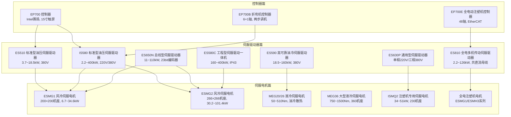

# 汇川电液伺服产品选型手册 — 课程蒸馏笔记（修正版）

**蒸馏时间**: 2026-06-27

---

## 一、课程概览

本课程系统性地介绍了汇川技术（INOVANCE）电液伺服产品线，共分为三大篇章：**伺服驱动器篇**（7个系列）、**伺服电机篇**（5个系列/类别）、**控制器篇**（3个产品）。课程旨在帮助工程师掌握各系列产品的定位、命名规则、关键技术参数及应用场景，为电液伺服系统的选型与设计提供专业指导。

- **伺服驱动器篇**：ES510 → IS580 → ES590 → ES650N → ES580C → ES630P → ES810，覆盖从标准型到工程型、从油压到全电驱动
- **伺服电机篇**：ESMG1/ESMG2风冷 → MEG20/26液冷 → MEG36大型液冷 → ISMQ2注塑机专用 → 全电注塑机专用
- **控制器篇**：EP700系列 → EP700E注塑机专用 → EP700B折弯机专用

---

## 二、课程体系图

---

## 三、逐章精要

### 3.1 伺服驱动器篇

#### A1 ES510 系列标准型油压伺服驱动器
- **功率范围**：3.7~18.5kW（6个规格：009/013/017/025/032/037）
- **电压**：三相380~480VAC，50/60Hz
- **特点**：内置高性能油压控制算法、免调谐、支持CANopen/Modbus/DP/Profinet
- **过载能力**：150%额定电流60s
- **输出频率**：最高300Hz
- **载波频率**：2.0~8.0kHz

#### A2 IS580 系列标准型油压伺服驱动器
- **功率范围**：2.2~400kW（22个规格：040~720）
- **电压**：三相220V（2T系列）和三相380V（T系列）
- **特点**：成熟丰富的行业工艺应用控制、支持EtherCAT/DP/Profinet
- **控制方式**：闭环矢量(FVC)、开环矢量(SVC)、V/F控制
- **调速范围**：1:1000(FVC)，启动转矩0Hz/180%

#### A3 ES590 系列高可靠油冷伺服驱动器
- **功率范围**：18.5~160kW（11个规格：035~300）
- **散热方式**：油冷散热，适应恶劣环境
- **注**：080~300规格预计2021年7月可批量供货
- 与其他系列共享相同的控制架构和功能特性

#### A4 ES650N 系列总线型伺服驱动器
- **功率范围**：11~110kW（11个规格：25~210）
- **编码器**：23bit绝对值编码器
- **特点**：标配EtherCAT总线、250us同步周期、标准CiA-402协议
- **结构**：塑胶结构（25~75A规格）和钣金结构（91~210A规格）

#### A5 ES580C 系列工程型伺服驱动一体机
- **功率范围**：160~400kW（8个规格：300~720）
- **特点**：集成断路器/接触器/电抗器/滤波器/制动单元/冷却回路
- **防护**：IP43防护设计、C3 EMC标准
- **配置等级**：S（标准款）/ L（精简款）

#### A6 ES630P 系列通用型伺服驱动器
- **单相220V**：S1R6/S2R8/S5R5（1.6~5.5A）
- **三相380V**：T3R5/T5R4/T8R4/T012/T017/T021/T026（3.5~25.7A）
- **速度控制范围**：1:5000
- **频率特性**：1.2kHz

#### A7 ES810 系列全电多机传动伺服驱动器
- **整流单元**：22/45/110/160kW，支持并联
- **逆变单元**：2.2~126kW，350~800VDC
- **过载能力**：150%~250%（不同规格有差异）
- **特点**：共直流母线、2路STO安全功能、23位绝对值编码器

---

### 3.2 伺服电机篇

#### B1 ESMG1 高性能风冷伺服电机（200×200机座）
- **额定转速**：1700/2000/2200rpm
- **额定转矩**：37.5~150N·m
- **额定功率**：6.7~34.6kW
- **峰值转矩**：86~390N·m
- **最高转速**：2500rpm
- **编码器**：A3系列23bit高性能编码器或旋转变压器
- **冷却**：强制风冷

#### B2 ESMG2 高性能风冷伺服电机（266×266机座）
- **额定转矩**：170~440N·m
- **额定功率**：30.2~101.4kW
- **效率**：95.7%~96.7%
- **峰值转矩比**：约1.65~1.7倍额定转矩

#### B3 MEG20/MEG26 系列高性能液冷伺服电机
- **MEG20**（200机座）：50~150N·m，重量55~100kg
- **MEG26**（260机座）：200~510N·m，重量155~275kg
- **特点**：油冷散热结构，适应高温高湿高油污环境
- **峰值转矩**：约2.0~2.2倍额定转矩

#### B4 MEG36 系列高性能液冷伺服电机（360×360机座）
- **额定转矩**：750~1500N·m（6个规格）
- **转速**：1200/1700rpm
- **特点**：大型液冷电机，适用于大功率伺服场合
- **重量**：320~420kg

#### B5 ISMQ2 系列高速液压注塑机专用风冷伺服电机
- **功率**：34/39.9/51kW（3个规格）
- **额定转矩**：191/224/286.5N·m
- **特点**：低惯量、高响应（<35ms）、230×230机座
- **峰值转矩**：2.5倍额定转矩

#### B6 全电注塑机专用伺服电机系列
- **包含**：ESMH3顶出电机（130/180机座，带抱闸）和ESMG1注射/合模/熔胶电机（200机座）
- **顶出电机**（ESMH3）：1.8~5.5kW，1500rpm，带抱闸
- **注射/熔胶电机**（ESMG1）：5.5~11.8kW
- **特点**：3.5倍过载转矩设计、低噪音、IP54防护

---

### 3.3 控制器篇

#### C1 EP700 系列控制器
- **CPU**：Intel Celeron 3855U，1.6GHz
- **内存**：4GB DDR4，SSD 64GB
- **显示**：15寸TFT，1024×768，电阻式触摸
- **接口**：2路LAN（1路EtherNET + 1路EtherCAT）、4路USB3.0、2路RS485
- **IP等级**：面板IP65，背板IP20

#### C2 EP700E 全电动注塑机控制器
- **运动轴数**：48轴（虚轴无限制）
- **扩展**：最大IO 65536点，最大128机架
- **总线**：EtherCAT 500us周期16轴同步
- **特点**：支持物联网平台数据监控，集成全套注塑工艺动作

#### C3 EP700B 折弯机控制器
- **轴控制**：标配6+1轴（EtherCAT总线）
- **特点**：两步调机三步折弯、支持辅助轴控制（电子凸轮/齿轮）
- **显示**：15寸TFT

---

## 四、关键参数速查表

| 项目 | ES510 | IS580 | ES590 | ES650N | ES580C | ES810 |
|------|-------|-------|-------|--------|--------|-------|
| 功率范围(kW) | 3.7~18.5 | 2.2~400 | 18.5~160 | 11~110 | 160~400 | 2.2~126 |
| 电压(V) | 380~480 | 220/380~480 | 380~480 | 380~480 | 380 | 350~800VDC |
| 过载能力 | 150%/60s | 150%/60s | 150%/60s | 150%/60s | 150%/60s | 150~250% |
| 最高频率 | 300Hz | 300Hz | 300Hz | 300Hz | 300Hz | 300Hz |
| 控制方式 | FVC/SVC/VF | FVC/SVC/VF | FVC/SVC/VF | FVC/SVC/VF | FVC/SVC/VF | — |
| 散热 | 风冷 | 风冷/油冷 | 油冷 | 风冷 | 风冷 | 风冷 |

| 项目 | ESMG1 | ESMG2 | MEG20/26 | MEG36 | ISMQ2 |
|------|-------|-------|----------|-------|-------|
| 转矩范围(Nm) | 37.5~150 | 170~440 | 50~510 | 750~1500 | 191~286.5 |
| 转速(rpm) | 1700~2200 | 1700~2200 | 1500~2000 | 1200~1700 | 1700 |
| 冷却 | 风冷 | 风冷 | 液冷 | 液冷 | 风冷 |
| 防护等级 | IP54 | IP54 | — | — | IP54 |
| 编码器 | A3/旋变 | A3/旋变 | A3 | A3 | A3/旋变 |

---

## 五、应用场景

| 应用行业 | 推荐驱动器 | 推荐电机 | 控制器 |
|----------|-----------|---------|--------|
| 注塑机 | ES510 / IS580 / ES810 | ESMG / ISMQ2 / 全电专用 | EP700E |
| 油压机 | ES510 / IS580 / ES590 | MEG20/26 | EP700 |
| 压铸机 | IS580 | MEG26/36 | EP700 |
| 折弯机 | IS580 / ES650N | ESMG1/2 | EP700B |
| 锻压机床 | IS580 | MEG36 | EP700 |
| 铝型材 | ES510 / IS580 | ESMG | EP700 |
| 全电动机 | ES810 | ESMG1/ESMH3 | EP700E |
| 砖机 | IS580 | — | EP700 |
